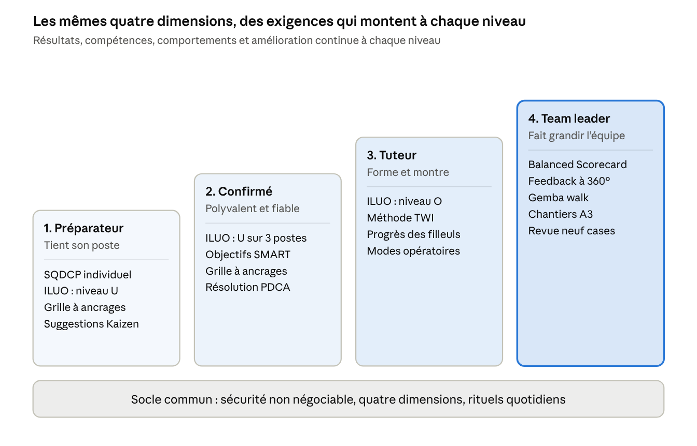

# Cadre d'évaluation en logistique — du préparateur au team leader

4 octobre 2026

## Synthèse

Le cadre recommandé évalue chaque collaborateur, du préparateur au team leader, sur quatre dimensions identiques, avec des exigences qui montent à chaque niveau. Il combine des outils éprouvés du Lean, de la gestion de la performance et du management des compétences.

**Les quatre dimensions :**

1. **Résultats.** Ce que la personne ou l'équipe produit : sécurité, qualité, délai, productivité. Outils : tableau de bord SQDCP et Balanced Scorecard.
2. **Compétences.** Ce que la personne sait faire, poste par poste. Outils : matrice de polyvalence ILUO et Training Within Industry.
3. **Comportements.** Comment la personne travaille avec les autres et applique les standards. Outils : grilles à ancrages comportementaux et, pour le team leader, feedback à 360 degrés.
4. **Amélioration continue.** Ce que la personne fait progresser. Outils : PDCA, suggestions Kaizen et A3.

**Pourquoi ce choix :**

- **Des faits plutôt que des impressions.** Chaque note s'appuie sur un indicateur, une observation au poste ou un exemple concret.
- **Une échelle commune.** Le préparateur et le team leader sont évalués sur les mêmes dimensions, ce qui rend la progression de carrière lisible.
- **Une évaluation continue.** Le cadre repose sur des rituels courts et fréquents, pas sur un seul entretien annuel.
- **Un lien direct avec l'intégration.** Il prolonge les programmes d'onboarding sur 30 jours et en une journée déjà en place.

## Le cadre en un coup d'œil

Chaque niveau garde les outils du précédent et en ajoute de nouveaux, plus tournés vers la transmission et l'équipe.

Le socle reste le même pour tous : la sécurité n'est jamais compensée par de bons résultats ailleurs.

## Les outils de la littérature

Treize outils couvrent les quatre dimensions. Aucun ne suffit seul : leur force vient de leur combinaison, chacun compensant les angles morts des autres.

### Résultats

| Outil | Origine | Ce qu'il apporte | Niveaux | Application en entrepôt |
| --- | --- | --- | --- | --- |
| Tableau SQDCP | Lean, Toyota Production System | Suivi quotidien de la Sécurité, de la Qualité, du Délai, du Coût et du Personnel | Tous | Tableau visuel par zone, mis à jour à chaque prise de poste |
| Balanced Scorecard | Kaplan et Norton, 1992 | Équilibre entre résultats financiers, clients, processus et apprentissage | Team leader et au-dessus | Tableau de bord mensuel de l'équipe, qui évite de tout réduire à la productivité |
| Indicateurs SCOR | Association for Supply Chain Management | Définitions standard des indicateurs logistiques, comme la commande parfaite | Team leader | Taux de commandes livrées complètes, à l'heure et sans erreur |
| Objectifs SMART | George Doran, 1981 | Objectifs spécifiques, mesurables, atteignables, réalistes et datés | Tous | Deux ou trois objectifs par personne et par semestre, pas davantage |

### Compétences

| Outil | Origine | Ce qu'il apporte | Niveaux | Application en entrepôt |
| --- | --- | --- | --- | --- |
| Matrice de polyvalence ILUO | Toyota | Niveau de chaque personne sur chaque poste : I en formation, L avec aide, U autonome, O capable de former | Tous | Tableau affiché : réception, préparation, mise en rayon, expédition, inventaire, conduite d'engin |
| Training Within Industry | Programme américain des années 1940, repris par Toyota | Trois modules : instruire au poste, gérer les relations, améliorer les méthodes | Tuteur et team leader | Le tuteur forme selon la méthode « préparer, montrer, faire faire, suivre » |
| Modèle de Kirkpatrick | Donald Kirkpatrick | Évaluation des formations sur quatre niveaux : réaction, apprentissage, comportement, résultat | Tous | Déjà utilisé dans le programme d'intégration sur 30 jours |

### Comportements

| Outil | Origine | Ce qu'il apporte | Niveaux | Application en entrepôt |
| --- | --- | --- | --- | --- |
| Grilles à ancrages comportementaux | Smith et Kendall, 1963 | Chaque note correspond à un comportement observable, ce qui réduit la subjectivité | Tous | Exemple détaillé plus bas |
| Feedback à 360 degrés | Littérature en développement du leadership | Regard croisé du responsable, des pairs et de l'équipe | Team leader | Une fois par an, anonyme, utilisé pour le développement et non pour la rémunération |
| Leadership situationnel | Hersey et Blanchard, 1969 | Le style de management s'adapte au niveau d'autonomie de chaque personne | Team leader | Diriger un nouvel arrivant, déléguer à un préparateur de niveau O |
| Gemba walk | Taiichi Ohno, Lean | Observation directe sur le terrain plutôt qu'au bureau | Team leader | Tour de zone quotidien avec une grille de quelques points |

### Amélioration continue

| Outil | Origine | Ce qu'il apporte | Niveaux | Application en entrepôt |
| --- | --- | --- | --- | --- |
| PDCA | Walter Shewhart et W. Edwards Deming | Cycle Planifier, Faire, Vérifier, Agir pour résoudre un problème | Tous | Traitement d'une erreur de préparation récurrente |
| Suggestions Kaizen et A3 | Toyota | Petites améliorations proposées par le terrain, problèmes complexes traités sur une page A3 | Kaizen pour tous, A3 pour le team leader | Nombre de suggestions mises en œuvre par personne et par équipe |

Deux outils servent à piloter les talents plutôt qu'à évaluer au quotidien. Le travail standardisé du leader, décrit par David Mann, fixe les routines du team leader. La grille « neuf cases », qui croise performance et potentiel, aide à repérer les futurs tuteurs et team leaders lors de la revue annuelle.

## Référentiel par niveau

Quatre niveaux structurent la progression. Le passage au niveau suivant exige d'atteindre toutes les attentes du niveau actuel, la sécurité étant non négociable à chaque étape.

| Dimension | 1. Préparateur | 2. Préparateur confirmé | 3. Tuteur ou référent de zone | 4. Team leader |
| --- | --- | --- | --- | --- |
| Résultats | Atteint le standard de cadence et le taux d'erreur toléré sur son poste | Dépasse le standard de façon régulière, y compris en période de pointe | Tient ses résultats tout en formant, et les résultats de ses filleuls progressent | Résultats SQDCP de l'équipe : sécurité, qualité, délai, productivité, présence |
| Compétences | Niveau U sur son poste principal dans la matrice ILUO | Niveau U sur au moins trois postes, niveau O sur un | Niveau O sur ses postes, certifié à la méthode d'instruction au poste | Maîtrise du WMS, de la planification d'équipe et des trois modules Training Within Industry |
| Comportements | Applique les standards et les consignes de sécurité, signale les anomalies | Aide spontanément ses collègues, s'adapte aux changements de poste | Explique avec patience, donne un retour constructif, montre l'exemple | Anime, écoute, recadre avec respect, adapte son style à chaque personne |
| Amélioration continue | Propose des suggestions Kaizen | Participe à la résolution de problèmes avec le PDCA | Met à jour les modes opératoires de sa zone | Pilote des chantiers A3, fait vivre le système de suggestions |
| Outils d'évaluation | SQDCP individuel, matrice ILUO, grille à ancrages | Idem, plus objectifs SMART | Idem, plus résultats de ses filleuls | Balanced Scorecard d'équipe, feedback à 360 degrés, observation des routines |

Les seuils chiffrés, comme la cadence standard ou le taux d'erreur toléré, sont fixés par site. Ils doivent être connus de tous avant le démarrage du cadre.

## Exemple de grille à ancrages comportementaux

Une grille à ancrages décrit, pour chaque note, ce que l'évaluateur doit avoir vu. Deux évaluateurs qui observent la même personne arrivent ainsi à la même note.

**Compétence « Qualité de préparation », niveaux 1 et 2 :**

| Note | Comportement observé |
| --- | --- |
| 1 – Insuffisant | Ne scanne pas systématiquement, laisse passer des erreurs de référence, monte des palettes instables |
| 2 – À développer | Scanne chaque ligne mais oublie parfois de contrôler la quantité. Palettes correctes avec rappel du tuteur |
| 3 – Attendu | Contrôle référence et quantité à chaque ligne, palette stable et étiquetée, taux d'erreur dans la tolérance du site |
| 4 – Exemplaire | Aucune erreur sur la période, signale les anomalies d'emplacement, aide ses collègues à corriger leurs erreurs |

**Compétence « Animation du point d'équipe », niveau 4 :**

| Note | Comportement observé |
| --- | --- |
| 1 – Insuffisant | Point annulé ou improvisé, indicateurs non à jour, pas d'action décidée |
| 2 – À développer | Point tenu mais dépasse le temps prévu, le team leader parle seul, les actions n'ont pas de responsable |
| 3 – Attendu | Point de 10 minutes à l'heure, tableau SQDCP à jour, chaque écart donne une action avec un nom et une date |
| 4 – Exemplaire | L'équipe prend la parole, les actions de la veille sont vérifiées, les réussites sont reconnues publiquement |

La même structure s'applique aux autres compétences du référentiel. Il faut compter une demi-journée de travail avec deux ou trois team leaders expérimentés pour rédiger les ancrages d'une compétence.

## Rythme d'évaluation

L'évaluation est un fil continu de rituels courts. L'entretien annuel ne fait que consolider ce qui a été vu et dit pendant l'année : il ne doit contenir aucune surprise.

| Fréquence | Rituel | Durée | Qui | Ce qui est évalué |
| --- | --- | --- | --- | --- |
| Chaque jour | Point d'équipe devant le tableau SQDCP | 10 min | Team leader et équipe | Résultats de la veille, écarts, actions |
| Chaque jour | Gemba walk | 20 à 30 min | Team leader | Respect des standards, sécurité, rangement |
| Chaque semaine | Entretien individuel court | 15 min par personne en difficulté ou en progression | Team leader | Objectifs, retour sur les observations, besoins |
| Chaque mois | Revue de la matrice ILUO | 30 min | Team leader et tuteurs | Progression de la polyvalence, plan de formation |
| Chaque mois | Revue du Balanced Scorecard | 1 h | Responsable d'exploitation et team leaders | Tendances de l'équipe, actions correctives |
| Chaque semestre | Entretien d'évaluation | 45 min | Team leader et collaborateur | Grille à ancrages, objectifs SMART, souhaits d'évolution |
| Chaque année | Feedback à 360 degrés | Questionnaire de 20 min | Équipe, pairs et responsable du team leader | Leadership du team leader |
| Chaque année | Revue des talents avec la grille neuf cases | Demi-journée | Direction du site et RH | Potentiel, successeurs, promotions vers tuteur ou team leader |

## Évaluer le team leader

Un team leader s'évalue sur ce que son équipe accomplit et sur la façon dont il la fait grandir, pas sur sa propre productivité au poste. Son tableau de bord suit la logique du Balanced Scorecard : quatre familles d'indicateurs, équilibrées entre elles.

| Famille | Indicateurs proposés | Source |
| --- | --- | --- |
| Sécurité | Accidents avec et sans arrêt, presque-accidents signalés, observations de sécurité réalisées | Registre sécurité, conseiller en prévention |
| Clients et qualité | Taux de commandes parfaites, taux d'erreur de préparation, taux de rupture en rayon | WMS, contrôles qualité, retours clients |
| Processus | Productivité de l'équipe en % du standard, respect des délais d'expédition, casse | WMS, planning |
| Personnes et apprentissage | Taux de polyvalence ILUO, absentéisme, départs dans les 6 premiers mois, suggestions Kaizen mises en œuvre, résultat du feedback à 360 degrés | Matrice ILUO, RH, système de suggestions |

**Le travail standardisé du leader.** David Mann montre qu'un système Lean tient par les routines de ses managers. Le responsable du team leader vérifie donc, par une observation mensuelle, que les routines suivantes sont tenues :

- [ ] Point d'équipe quotidien tenu à l'heure, tableau SQDCP à jour.
- [ ] Gemba walk quotidien, avec au moins un écart traité par jour.
- [ ] Matrice ILUO mise à jour chaque mois.
- [ ] Entretiens individuels planifiés et réalisés.
- [ ] Accueil des nouveaux arrivants selon le programme d'intégration.
- [ ] Suggestions de l'équipe traitées sous 15 jours, avec une réponse à leur auteur.

**Le feedback à 360 degrés.** Il porte sur une dizaine de comportements : clarté des consignes, équité, écoute, reconnaissance, exemplarité en sécurité, gestion des tensions. Les réponses restent anonymes et ne sont restituées qu'à partir de trois répondants par groupe. Elles servent au plan de développement du team leader, pas à sa rémunération.

## Déployer le cadre en 90 jours

Le déploiement commence par une zone pilote, puis s'étend au site. Cette approche suit le cycle PDCA appliqué au cadre lui-même.

1. **Jours 1 à 15 : cadrer.**
    - Valider les quatre dimensions et les quatre niveaux avec la direction du site.
    - Fixer les seuils chiffrés par poste : cadence standard, taux d'erreur toléré.
    - Informer et consulter les représentants du personnel avant tout déploiement.
2. **Jours 16 à 30 : construire les outils.**
    - Rédiger les grilles à ancrages avec deux ou trois team leaders expérimentés.
    - Construire la matrice ILUO de chaque zone et le tableau SQDCP.
    - Former les team leaders à l'observation, au feedback et aux entretiens.
3. **Jours 31 à 60 : tester sur une zone pilote.**
    - Lancer les rituels quotidiens et hebdomadaires sur une seule zone, par exemple la préparation.
    - Recueillir l'avis des collaborateurs et des team leaders chaque semaine.
    - Corriger les grilles et les indicateurs qui posent problème.
4. **Jours 61 à 90 : étendre et ancrer.**
    - Déployer sur toutes les zones avec le kit corrigé.
    - Tenir la première revue mensuelle du Balanced Scorecard.
    - Planifier les premiers entretiens semestriels et le premier feedback à 360 degrés.

**Critères de réussite à 90 jours :**

- 100 % des collaborateurs connaissent leur niveau et les attentes du niveau suivant.
- Les points d'équipe quotidiens sont tenus au moins 9 jours ouvrés sur 10.
- La matrice ILUO est à jour dans chaque zone.
- Les team leaders jugent les grilles utiles et faciles à remplir.

## Pièges à éviter et points d'attention en Belgique

La littérature identifie des échecs récurrents dans les systèmes d'évaluation. Les connaître dès le départ permet de les prévenir.

**Pièges classiques :**

- **La course à l'indicateur.** Selon la loi de Goodhart, un indicateur qui devient un objectif cesse d'être une bonne mesure. Une prime liée à la seule cadence pousse à sacrifier la qualité et la sécurité. Il faut toujours associer productivité, qualité et sécurité.
- **Les biais de notation.** L'effet de halo, l'indulgence, la sévérité et l'effet de récence faussent les notes. Les grilles à ancrages et les observations notées au fil de l'eau les réduisent.
- **La santé sacrifiée à la cadence.** Des objectifs de productivité trop élevés augmentent le risque de troubles musculosquelettiques. Les standards doivent rester compatibles avec l'analyse des risques du poste.
- **La surveillance perçue.** Les données individuelles du WMS sont très fines. Utilisées sans transparence, elles détruisent la confiance. Elles doivent servir à aider, pas à traquer.
- **Le 360 degrés mal utilisé.** Lié à la rémunération ou restitué sans accompagnement, il crée de la défiance. Il doit rester un outil de développement.
- **L'évaluation sans suite.** Une note sans plan de formation ni perspective d'évolution démotive. Chaque entretien doit déboucher sur une action.

**Points d'attention en Belgique :**

- **Concertation sociale.** Informer et consulter le conseil d'entreprise ou, à défaut, la délégation syndicale avant de déployer le cadre. Le comité pour la prévention et la protection au travail est concerné par les volets sécurité et charge de travail.
- **Protection des données.** Le RGPD s'applique aux données de performance individuelles. Il faut informer les collaborateurs des données utilisées, de leur finalité et de leur durée de conservation, et se limiter au nécessaire.
- **Non-discrimination.** Les critères doivent être objectifs, liés au poste et appliqués de la même façon à tous, y compris aux intérimaires et aux travailleurs à temps partiel.
- **Règlement de travail.** Si l'évaluation a des conséquences sur la rémunération ou débouche sur des sanctions, vérifier la cohérence avec le règlement de travail et la convention collective du secteur.
- **Validation juridique.** Faire relire le dispositif par le service juridique ou le secrétariat social avant son lancement.

## Sources

Références bibliographiques, citées de mémoire et non consultées en ligne pour ce document.

- Robert Kaplan et David Norton, « The Balanced Scorecard: Measures That Drive Performance », *Harvard Business Review*, 1992.
- Patricia Smith et Lorne Kendall, « Retranslation of Expectations », *Journal of Applied Psychology*, 1963 : origine des grilles à ancrages comportementaux.
- George Doran, « There's a S.M.A.R.T. Way to Write Management's Goals and Objectives », *Management Review*, 1981.
- Jeffrey Liker, *The Toyota Way*, McGraw-Hill, 2004.
- Taiichi Ohno, *Toyota Production System: Beyond Large-Scale Production*, Productivity Press.
- David Mann, *Creating a Lean Culture: Tools to Sustain Lean Conversions*, Productivity Press : travail standardisé du leader.
- Donald Dinero, *Training Within Industry: The Foundation of Lean*, Productivity Press, 2005.
- W. Edwards Deming, *Out of the Crisis*, MIT Press, 1986 : cycle PDCA.
- Paul Hersey et Kenneth Blanchard, *Management of Organizational Behavior*, Prentice Hall : leadership situationnel.
- Donald et James Kirkpatrick, *Evaluating Training Programs: The Four Levels*, Berrett-Koehler.
- Association for Supply Chain Management, modèle SCOR : indicateurs de performance de la chaîne logistique.
- Charles Goodhart, 1975 : loi de Goodhart sur les indicateurs devenus objectifs.
- [Programme d'onboarding sur 30 jours](../onboarding-preparateur-commandes/README.md) et [en une journée](../onboarding-preparateur-commandes/journee-8h.md) : documents complémentaires à ce cadre.
