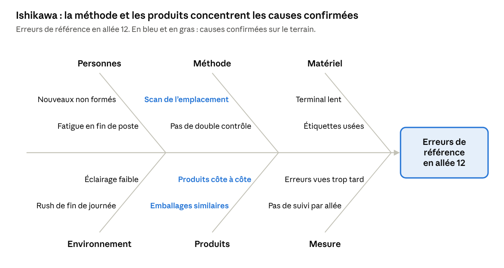

# Ma méthode de manager — résoudre les problèmes et faire grandir l'équipe

6 octobre 2026

## Introduction

Je m'appuie sur quatre outils reconnus pour manager l'équipe : deux pour résoudre les problèmes à la racine, deux pour me développer comme manager et faire progresser chacun. Ce document explique comment je les utiliserai concrètement sur le terrain.

| Objectif | Outil | En une phrase |
| --- | --- | --- |
| Résoudre les problèmes | Les 5 Pourquoi | Demander « pourquoi » plusieurs fois de suite pour trouver la vraie cause d'une erreur. |
| Résoudre les problèmes | Le diagramme d'Ishikawa | Chercher les causes d'un problème par catégorie : personnes, méthode, matériel, environnement. |
| Me développer comme manager | Le management situationnel | Adapter mon style à chaque personne : diriger davantage un nouveau, déléguer davantage à une personne expérimentée. |
| Me développer comme manager | Les objectifs SMART | Fixer des objectifs Spécifiques, Mesurables, Atteignables, Réalistes et Temporels. |

**Mon principe de base :** quand une erreur se produit, je cherche ce qui dans l'organisation l'a rendue possible, pas un coupable. Une personne qui se sent jugée cache les problèmes. Une personne écoutée les signale tôt, quand ils coûtent encore peu.

## Résoudre les problèmes : les 5 Pourquoi

Les 5 Pourquoi consistent à demander « pourquoi » plusieurs fois de suite, jusqu'à trouver la vraie cause d'une erreur. La méthode vient de Toyota, où Taiichi Ohno l'a diffusée. Elle est simple, rapide et se fait directement sur le terrain.

**Comment je l'applique :**

1. **Décrire le problème avec des faits.** Quoi, où, quand, combien. Par exemple : « 14 erreurs de référence la semaine dernière, dont 9 en allée 12. »
2. **Aller voir sur place.** Je pose les questions devant le poste, avec les personnes qui y travaillent.
3. **Demander « pourquoi » à chaque réponse.** Cinq fois est un repère, pas une règle : je m'arrête quand j'arrive à une cause sur laquelle on peut agir.
4. **Vérifier la cause.** Si je supprime cette cause, le problème disparaît-il ? Sinon, je reprends.
5. **Agir et mesurer.** Une action, un responsable, une date, puis un suivi pendant quelques semaines.

**Exemple : des erreurs de référence en allée 12.**

| Question | Réponse trouvée sur le terrain |
| --- | --- |
| 1. Pourquoi le client a-t-il reçu la mauvaise référence ? | Le préparateur a pris le produit de l'emplacement voisin. |
| 2. Pourquoi a-t-il pris le produit voisin ? | Les deux produits ont un emballage presque identique et sont rangés côte à côte. |
| 3. Pourquoi le scan n'a-t-il pas bloqué l'erreur ? | Le préparateur a scanné l'étiquette de l'emplacement, pas le produit. |
| 4. Pourquoi a-t-il scanné l'emplacement ? | Le mode opératoire l'autorise, pour gagner du temps. |
| 5. Pourquoi le mode opératoire l'autorise-t-il ? | Il a été écrit avant l'arrivée de ces produits similaires et n'a jamais été revu. |

**Cause racine :** un mode opératoire qui ne protège pas contre la confusion entre produits similaires. Ce n'est pas une faute du préparateur.

**Actions décidées :**

- Scan du produit obligatoire pour les références à risque de confusion.
- Séparation physique des produits similaires et repère visuel sur l'emplacement.
- Revue du mode opératoire à chaque arrivée de nouvelle référence.
- Suivi du taux d'erreur de l'allée 12 chaque semaine pendant un mois.

**Le piège que j'évite :** s'arrêter à « le préparateur n'a pas fait attention ». Cette réponse ne règle rien : la même erreur reviendra avec la personne suivante.

## Résoudre les problèmes : le diagramme d'Ishikawa

Le diagramme d'Ishikawa, ou diagramme en arête de poisson, classe les causes possibles d'un problème par catégorie. Kaoru Ishikawa l'a conçu pour qu'une équipe n'oublie aucune piste. Je l'utilise quand un problème résiste ou semble avoir plusieurs causes.

**Les catégories que j'utilise :** les personnes, la méthode, le matériel et l'environnement. J'y ajoute les produits et la mesure quand le problème s'y prête, ce qui correspond aux « 6 M » de la littérature qualité.

**Comment je l'anime, en 45 minutes avec l'équipe :**

1. **Écrire le problème à la tête du poisson**, avec des faits chiffrés.
2. **Chercher les causes famille par famille.** Chacun propose, sans critiquer les idées des autres.
3. **Choisir les causes les plus probables** par un vote rapide.
4. **Les vérifier sur le terrain** avant de décider. Une cause non vérifiée reste une hypothèse.
5. **Creuser chaque cause confirmée avec les 5 Pourquoi**, puis lancer les actions.

**Exemple sur le même problème d'erreurs en allée 12 :**

L'atelier fait apparaître douze causes possibles. Trois sont confirmées sur le terrain, dans deux familles : la méthode et les produits. Les deux outils se complètent : Ishikawa élargit la recherche, les 5 Pourquoi l'approfondissent.

## Me développer comme manager : le management situationnel

Le management situationnel, décrit par Paul Hersey et Kenneth Blanchard, part d'une idée simple : il n'existe pas un bon style de management, mais un style adapté à chaque personne et à chaque tâche. Je dirige davantage un nouvel arrivant, je délègue davantage à une personne expérimentée.

| Style | Pour qui | Ce que je fais | Exemple en entrepôt |
| --- | --- | --- | --- |
| 1. Diriger | Personne qui débute sur la tâche, motivée mais sans expérience. Niveau I de la matrice de polyvalence. | Je dis quoi faire et comment, je montre, je contrôle souvent. | Un intérimaire le premier jour : je lui explique chaque étape de la préparation et je vérifie ses premières commandes. |
| 2. Entraîner | Personne qui progresse, mais peut se décourager devant les difficultés. Niveau L. | J'explique le pourquoi, j'encourage, je corrige, je contrôle encore. | Un préparateur en deuxième semaine : je fais le point chaque jour sur ses erreurs et je souligne ses progrès. |
| 3. Épauler | Personne compétente, qui manque parfois de confiance. Niveau U. | J'écoute, je demande son avis, je décide avec elle. | Un préparateur confirmé qui hésite à devenir tuteur : je l'aide à trouver ses solutions plutôt que de les donner. |
| 4. Déléguer | Personne compétente et engagée. Niveau O. | Je confie la tâche et le résultat attendu, je fais un point de temps en temps. | Un tuteur expérimenté : je lui confie l'accueil complet d'un nouvel arrivant. |

**Ce que je retiens :**

- **Le style dépend de la tâche, pas seulement de la personne.** Un préparateur peut être au niveau O en préparation et au niveau I en expédition. Je l'épaule sur la première et je le dirige sur la seconde.
- **L'objectif est de faire monter chacun en autonomie.** Je passe progressivement du style 1 au style 4, au rythme de la personne.
- **Les deux erreurs à éviter.** Diriger de près une personne expérimentée la démotive. Laisser seule une personne qui débute la met en échec, et parfois en danger.
- **La sécurité ne se délègue pas.** Quel que soit le style, les règles de sécurité s'appliquent à tous et je les fais respecter.

## Me développer comme manager : les objectifs SMART

Un objectif SMART est Spécifique, Mesurable, Atteignable, Réaliste et Temporel. Le principe a été formulé par George Doran en 1981. Avant d'annoncer un objectif, je vérifie qu'il répond aux cinq questions suivantes.

| Lettre | Critère | La question que je me pose |
| --- | --- | --- |
| S | Spécifique | Est-ce que la personne sait exactement ce qu'on attend d'elle ? |
| M | Mesurable | Avec quel chiffre saura-t-on que l'objectif est atteint ? |
| A | Atteignable | La personne a-t-elle les moyens, la formation et le temps nécessaires ? |
| R | Réaliste | L'objectif tient-il compte de la charge réelle et du niveau de la personne ? |
| T | Temporel | Pour quand, et quand fait-on le point ? |

**Exemples avant et après :**

| Pour qui | Objectif flou | Objectif SMART |
| --- | --- | --- |
| Un préparateur | « Faire moins d'erreurs. » | « Passer de 0,6 % à 0,4 % d'erreurs de préparation d'ici le 31 décembre, avec un point chaque semaine sur le tableau d'équipe. » |
| Un nouvel arrivant | « Aller plus vite. » | « Atteindre 70 % du standard de cadence d'ici la fin de la troisième semaine, sans dépasser le taux d'erreur toléré. » |
| Un tuteur | « Bien former les nouveaux. » | « Amener le nouvel arrivant au niveau U sur la préparation en 30 jours, avec la grille d'évaluation remplie chaque fin de semaine. » |
| L'équipe | « Améliorer la sécurité. » | « Zéro accident avec arrêt et au moins 10 presque-accidents signalés ce trimestre, suivis au briefing quotidien. » |
| Moi, comme manager | « Mieux accompagner l'équipe. » | « Réaliser un entretien individuel avec chaque membre de l'équipe d'ici le 30 novembre, et un point de suivi un mois après. » |

**Mes règles :**

- **Deux ou trois objectifs par personne, pas plus.** Au-delà, plus rien n'est prioritaire.
- **Toujours la qualité et la sécurité avec le volume.** Un objectif de vitesse seul pousse à prendre des risques.
- **Un objectif se construit avec la personne.** Je l'explique, j'écoute ses contraintes, puis on s'accorde sur la cible.

Les chiffres des exemples sont illustratifs : je les adapterai aux standards de notre site.

## Comment je m'organiserai au quotidien

Ces outils ne servent que s'ils sont utilisés régulièrement, à des moments fixes. Je les intègre aux rituels de l'équipe plutôt que d'en faire des réunions supplémentaires.

| Situation | Outil | Quand et combien de temps |
| --- | --- | --- |
| Une erreur simple ou un incident se répète | Les 5 Pourquoi | Sur le terrain, le jour même, en 15 minutes avec les personnes concernées |
| Un problème persiste ou a plusieurs causes possibles | Le diagramme d'Ishikawa | En atelier de 45 minutes avec l'équipe, une fois par semaine si besoin |
| J'affecte une personne à un poste ou je lui confie une mission | Le management situationnel | À chaque affectation, en m'appuyant sur la matrice de polyvalence |
| Je fixe un cap à une personne ou à l'équipe | Les objectifs SMART | Au briefing quotidien, et lors des entretiens individuels |

**Mes engagements :**

- [ ] Traiter chaque erreur récurrente à la racine avant la fin de la semaine.
- [ ] Afficher sur le tableau d'équipe les problèmes en cours, leur cause et l'action décidée.
- [ ] Faire le point sur le style de management adapté à chaque personne lors de la revue mensuelle de la polyvalence.
- [ ] Donner à chaque membre de l'équipe deux ou trois objectifs SMART, revus à chaque entretien.
- [ ] Mesurer mes propres résultats de manager : erreurs récurrentes éliminées, progression de la polyvalence, objectifs atteints.

Ces quatre outils complètent le [cadre d'évaluation](../cadre-evaluation-logistique/README.md) et l'[organisation des objectifs de la journée](../objectifs-journee/README.md) déjà présentés.

## Sources

Références bibliographiques, citées de mémoire et non consultées en ligne pour ce document.

- Taiichi Ohno, *Toyota Production System: Beyond Large-Scale Production*, Productivity Press : méthode des 5 Pourquoi.
- Kaoru Ishikawa, *Guide to Quality Control*, Asian Productivity Organization : diagramme causes-effet.
- Paul Hersey et Kenneth Blanchard, *Management of Organizational Behavior*, Prentice Hall : management situationnel.
- George Doran, « There's a S.M.A.R.T. Way to Write Management's Goals and Objectives », *Management Review*, 1981.
- Jeffrey Liker, *The Toyota Way*, McGraw-Hill, 2004 : résolution de problèmes sur le terrain.
