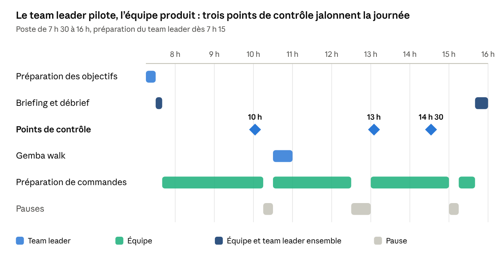

# Organiser les objectifs de la journée — collaborateurs et team leaders

4 octobre 2026

## Synthèse

Les objectifs de la journée se construisent à partir des volumes prévus, se déclinent de l'équipe vers chaque personne et se pilotent heure par heure. Le team leader a ses propres objectifs : il est jugé sur la réussite de son équipe et sur la tenue de ses routines.

**La méthode en quatre temps :**

1. **Calculer.** Avant la prise de poste, le team leader convertit les volumes du jour en heures de travail, puis en effectif et en objectifs horaires.
2. **Annoncer.** Au briefing de démarrage, chacun reçoit trois ou quatre objectifs clairs : sécurité, qualité, volume et un point de progrès.
3. **Piloter.** Trois points de contrôle dans la journée comparent le réalisé à l'objectif. Chaque écart donne une action immédiate.
4. **Boucler.** En fin de poste, l'équipe fait le bilan, le team leader transmet à l'équipe suivante et note ce qui alimente l'évaluation.

**Ce que la méthode apporte :**

- **Des objectifs justes.** Ils découlent de la charge réelle du jour et du niveau de chaque personne, pas d'un chiffre fixe imposé à tous.
- **Des écarts vus tôt.** Un retard repéré à 10 h se rattrape. Le même retard découvert à 15 h fait rater l'heure limite d'expédition.
- **Un lien direct avec l'évaluation.** Les résultats du jour alimentent le tableau SQDCP, la grille des collaborateurs et la grille des team leaders déjà en place.

## La journée en un coup d'œil

L'équipe consacre l'essentiel de la journée à produire. Le team leader l'encadre par des rituels courts, placés avant les moments où un retard deviendrait irrattrapable.

Le point de contrôle de 13 h est le plus important : il reste assez de temps pour décider d'un renfort ou d'une priorisation avant l'heure limite d'expédition.

## La cascade des objectifs

Un objectif du jour n'a de sens que s'il contribue à un objectif plus large. La méthode du Hoshin Kanri, décrite par Yoji Akao, décline les priorités du site jusqu'au poste de travail. Les mêmes cinq rubriques SQDCP servent à chaque étage, pour que chacun parle le même langage.

| Étage | Horizon | Exemple d'objectif | Fixé par | Suivi sur |
| --- | --- | --- | --- | --- |
| Site | Année et mois | Taux de commandes parfaites de 98,5 %, zéro accident avec arrêt | Direction du site | Balanced Scorecard mensuel |
| Équipe | Jour | 9 600 lignes préparées avant 15 h 30, zéro erreur client, zéro accident | Team leader, à partir des volumes du jour | Tableau SQDCP et tableau heure par heure |
| Personne | Jour et heure | 110 lignes par heure productive, zéro erreur, équipements portés en permanence | Team leader, selon le poste et le niveau ILUO | Tableau heure par heure et terminal de scan |

La cascade fonctionne aussi dans l'autre sens. Les écarts du jour remontent au team leader, puis au responsable d'exploitation, ce qui permet d'ajuster les moyens le lendemain.

## Calculer les objectifs du jour

L'objectif du jour se calcule en quatre étapes, à partir des volumes annoncés par le WMS ou le service client. Les chiffres ci-dessous sont un exemple à remplacer par les standards du site.

- Heures nécessaires = volume prévu en lignes ÷ standard en lignes par heure
- Effectif = heures nécessaires ÷ temps productif par personne

**Étape 1 : convertir le volume en heures.** 9 600 lignes prévues, divisées par un standard de 110 lignes par heure, donnent 87,3 heures de préparation.

**Étape 2 : calculer le temps productif par personne.** Sur une journée de 8 heures, on retire les deux pauses de 15 minutes, le briefing de 10 minutes et les 20 minutes de fin de poste. Il reste 7 heures productives.

**Étape 3 : tenir compte du niveau de chacun.** Un nouvel arrivant ne produit pas encore au standard. Les paliers du programme d'intégration servent de référence.

| Personnes | Niveau | Capacité en équivalent confirmé | Objectif horaire individuel |
| --- | --- | --- | --- |
| 11 | Confirmés | 11 × 100 % = 11,0 | 110 lignes |
| 1 | Nouvel arrivant en semaine 2 | 50 % = 0,5 | 55 lignes |
| 1 | Nouvel arrivant en semaine 3 | 70 % = 0,7 | 77 lignes |
| **13** | **Équipe** | **12,2** | **1 342 lignes pour l'équipe** |

**Étape 4 : comparer la capacité à la charge.** L'équipe peut préparer 12,2 × 7 heures × 110 lignes, soit 9 394 lignes. Il manque 206 lignes, environ 2 heures de travail. Le team leader le sait avant 7 h 30 et décide dès le briefing :

- demander un renfort de 2 heures à une autre zone ;
- ou faire valider par le responsable d'exploitation quelles commandes passent en priorité avant l'heure limite d'expédition.

L'objectif annoncé à chacun est donc réaliste. Un objectif impossible démotive et pousse à prendre des risques.

## Les objectifs du jour des collaborateurs

Chaque collaborateur reçoit quatre objectifs au maximum, toujours dans le même ordre. La sécurité et la qualité passent avant le volume : un préparateur ne doit jamais avoir à choisir entre aller vite et bien faire.

| Ordre | Objectif | Exemple formulé au briefing | Comment il le suit |
| --- | --- | --- | --- |
| 1 | Sécurité | « Zéro accident, équipements portés toute la journée, attention au croisement des allées 4 et 5 où un chariot circule. » | Consigne sécurité du jour affichée sur le tableau |
| 2 | Qualité | « Zéro erreur de référence : contrôle de la quantité à chaque ligne. » | Alertes du terminal, contrôles qualité |
| 3 | Volume | « 110 lignes par heure, soit environ 770 lignes sur la journée. » Pour un nouvel arrivant : l'objectif de son palier. | Tableau heure par heure, compteur du terminal |
| 4 | Progrès | « Aujourd'hui, tu passes deux heures en expédition avec ton tuteur. » Ou : « Note une idée pour améliorer ton poste. » | Matrice ILUO, boîte à suggestions |

**Les règles d'un bon objectif du jour :**

- **SMART.** Spécifique, mesurable, atteignable, réaliste et daté, selon George Doran. « Fais de ton mieux » n'est pas un objectif.
- **Adapté au niveau.** L'objectif de volume suit le niveau ILUO de la personne et le palier d'intégration pour un nouvel arrivant.
- **Visible.** Les objectifs de l'équipe sont écrits sur le tableau avant le briefing. Chacun peut voir à tout moment où en est l'équipe.
- **Collectif d'abord.** Le volume se pilote d'abord au niveau de l'équipe. L'objectif individuel sert à repérer qui a besoin d'aide, pas à classer les personnes.
- **Stable.** Si les volumes changent en cours de journée, le team leader le dit à l'équipe et met le tableau à jour. Un objectif qui change sans explication perd sa crédibilité.

## Les objectifs du jour des team leaders

Le team leader ne prépare pas de commandes pour tenir son objectif. Son travail est de faire réussir l'équipe, de faire grandir les personnes et de traiter les problèmes à la racine. Ses objectifs du jour couvrent donc quatre familles.

| Famille | Objectif du jour | Mesure en fin de poste |
| --- | --- | --- |
| Résultats de l'équipe | Volume préparé avant l'heure limite d'expédition, zéro erreur client, zéro accident | Tableau SQDCP mis à jour |
| Personnes | Effectif affecté selon la polyvalence, absences compensées, nouveaux arrivants accompagnés selon leur programme | Planning réalisé, matrice ILUO |
| Routines | Briefing tenu à l'heure, trois points de contrôle réalisés, gemba walk fait, passation transmise | Liste des routines cochée |
| Amélioration | Un écart traité à la racine, une suggestion de l'équipe reçue ou traitée | Fiche d'écart ou de suggestion remplie |

**La répartition de son temps.** David Mann montre que le travail standardisé du leader occupe une part importante de la journée d'un team leader. Le reste sert à réagir aux aléas. Une bonne répartition indicative :

- environ la moitié du temps sur le terrain, auprès de l'équipe : gemba walk, appui aux postes en difficulté, formation au poste ;
- environ un quart sur le pilotage : calcul des objectifs, points de contrôle, mise à jour des tableaux ;
- environ un quart sur les personnes et l'amélioration : entretiens courts, traitement des écarts, suggestions.

Un team leader qui passe l'essentiel de sa journée à préparer des commandes signale un sous-effectif à traiter avec le responsable d'exploitation. Ce n'est pas une solution durable.

## Les rituels de la journée

Sept rituels courts structurent la journée. Chacun a une heure fixe, une durée courte et un résultat attendu. Les horaires suivent un poste de 7 h 30 à 16 h, à décaler selon le site.

| Heure | Rituel | Durée | Qui | Résultat attendu |
| --- | --- | --- | --- | --- |
| 7 h 15 | Préparation du team leader | 15 min | Team leader | Volumes lus, objectifs calculés, affectations décidées, tableau rempli |
| 7 h 30 | Briefing de démarrage devant le tableau SQDCP | 10 min | Team leader et équipe | Bilan de la veille, consigne sécurité, objectifs et affectations du jour |
| 10 h | Point de contrôle n° 1 | 5 min | Team leader | Réalisé comparé à l'objectif cumulé, premières réaffectations |
| 10 h 30 à 11 h | Gemba walk | 20 à 30 min | Team leader | Standards, sécurité et rangement vérifiés, un écart traité |
| 13 h | Point de contrôle n° 2, à mi-journée | 10 min | Team leader, avec le responsable d'exploitation si besoin | Prévision de fin de journée, décision de renfort ou de priorisation |
| 14 h 30 | Point de contrôle n° 3, avant l'heure limite | 5 min | Team leader | Dernières priorités pour tenir l'expédition |
| 15 h 40 | Débrief et passation | 20 min | Team leader et équipe | Résultats du jour, réussites reconnues, consignes transmises à l'équipe suivante |

**La trame du briefing de 10 minutes :**

1. **Sécurité, 2 minutes.** Incident ou presque-accident de la veille, consigne du jour.
2. **Résultats de la veille, 2 minutes.** Ce qui a marché, ce qui a manqué, sans désigner de coupable.
3. **Objectifs du jour, 3 minutes.** Volume, heure limite, priorités client, objectifs horaires.
4. **Affectations, 2 minutes.** Qui est où, qui accompagne qui, qui forme qui.
5. **Questions, 1 minute.** Chacun peut signaler un problème ou une idée.

**La trame du débrief de fin de poste :**

1. Résultats du jour sur le tableau SQDCP, comparés aux objectifs.
2. Une réussite reconnue, si possible nommément.
3. Un écart et sa cause, avec l'action décidée pour demain.
4. Rangement du poste et consignes écrites pour l'équipe suivante.

## Piloter heure par heure et réagir aux écarts

Le tableau heure par heure, issu du Lean, affiche pour chaque tranche l'objectif, le réalisé et l'écart. Il transforme un objectif de journée en une suite de petits objectifs que l'équipe peut suivre d'un coup d'œil.

**Exemple de tableau pour l'équipe de 13 personnes** : objectif de 1 342 lignes par heure productive, soit 9 394 lignes sur 7 heures. Les tranches qui contiennent une pause ont un objectif réduit d'autant.

| Tranche | Objectif de la tranche | Objectif cumulé | Réalisé cumulé | Écart | Cause | Action |
| --- | --- | --- | --- | --- | --- | --- |
| 7 h 40 – 8 h | 447 | 447 | 430 | – 17 | Démarrage du terminal lent | Aucune |
| 8 h – 9 h | 1 342 | 1 789 | 1 720 | – 69 | Emplacements vides en allée 7 | Signalé au réapprovisionnement |
| 9 h – 10 h | 1 342 | 3 131 | 2 950 | – 181 | Un nouvel arrivant bloqué sur les produits lourds | Tuteur envoyé en appui 30 minutes |
| 10 h – 11 h, pause de 15 min | 1 007 | 4 138 | | | | |
| 11 h – 12 h | 1 342 | 5 480 | | | | |
| 12 h – 12 h 30 | 671 | 6 151 | | | | |
| 13 h – 14 h | 1 342 | 7 493 | | | | |
| 14 h – 15 h | 1 342 | 8 835 | | | | |
| 15 h 15 – 15 h 40 | 559 | 9 394 | | | | |

Les 206 lignes manquantes pour atteindre 9 600 sont couvertes par le renfort de 2 heures décidé au briefing.

**Comment réagir à un écart :**

| Écart au point de contrôle | Réaction | Qui décide |
| --- | --- | --- |
| Moins de 3 % de retard | On continue. L'équipe est informée de sa position. | Team leader |
| De 3 à 10 % de retard | Cause identifiée, réaffectation selon la polyvalence, appui aux postes en difficulté. | Team leader |
| Plus de 10 %, ou heure limite menacée | Renfort d'une autre zone, priorisation des commandes client, heures supplémentaires dans le respect des règles. | Responsable d'exploitation, sur proposition du team leader |
| Tout problème de sécurité | Arrêt immédiat de la tâche concernée, quel que soit le retard. | Toute personne qui le constate |

Dans l'exemple, l'écart de 10 h atteint 5,8 % du cumul. Il se situe dans la deuxième bande : le team leader réaffecte sans attendre. Un retard ne se rattrape jamais en sautant un contrôle qualité ou une règle de sécurité.

## Modèles prêts à l'emploi

Deux fiches d'une page suffisent pour organiser la journée. Elles se remplissent en quelques minutes et se conservent pour l'évaluation.

### Fiche du jour du collaborateur

| Rubrique | À remplir |
| --- | --- |
| Nom, date, poste affecté | |
| Niveau ILUO sur ce poste | |
| Objectif sécurité du jour | |
| Objectif qualité du jour | |
| Objectif volume : lignes par heure et total de la journée | |
| Objectif de progrès : formation, polyvalence, suggestion | |
| Réalisé en fin de journée | |
| Ce qui m'a aidé, ce qui m'a freiné | |

### Fiche du jour du team leader

**Avant la prise de poste :**

- [ ] Volumes du jour lus et convertis en heures de travail.
- [ ] Effectif présent comparé à l'effectif nécessaire.
- [ ] Affectations décidées selon la matrice ILUO, nouveaux arrivants avec leur tuteur.
- [ ] Objectifs de l'équipe et tableau heure par heure remplis.
- [ ] Consigne sécurité du jour choisie.

**Pendant la journée :**

- [ ] Briefing tenu à 7 h 30, en 10 minutes.
- [ ] Point de contrôle de 10 h réalisé.
- [ ] Gemba walk réalisé, un écart traité.
- [ ] Point de contrôle de 13 h réalisé, prévision de fin de journée faite.
- [ ] Point de contrôle de 14 h 30 réalisé.

**En fin de poste :**

- [ ] Tableau SQDCP mis à jour.
- [ ] Débrief tenu, une réussite reconnue.
- [ ] Consignes transmises à l'équipe suivante.
- [ ] Observations notées pour les entretiens et la grille d'évaluation.

Ces fiches alimentent directement le classeur Excel des grilles d'évaluation : le réalisé du jour sert de preuve pour les notes de résultats, et la liste du team leader pour la rubrique des routines.

## Pièges à éviter et points d'attention en Belgique

**Pièges classiques :**

- **Trop d'objectifs.** Au-delà de quatre, plus personne ne sait ce qui compte vraiment. La sécurité se dilue en premier.
- **Un objectif de volume seul.** Il pousse à sauter les contrôles et à prendre des risques. Le volume s'annonce toujours avec la qualité et la sécurité.
- **Le classement public.** Afficher le classement individuel des préparateurs crée de la pression et de la défiance. Le tableau affiche les résultats de l'équipe.
- **Le point de contrôle sans action.** Constater un retard sans décider rien d'autre que « il faut accélérer » ne sert à rien. Chaque écart a une cause et une action.
- **Le team leader au poste.** S'il compense le manque d'effectif en préparant lui-même, plus personne ne pilote. Le sous-effectif doit remonter.
- **Le nouvel arrivant au standard.** Lui appliquer l'objectif d'un confirmé le met en échec et en danger. Son objectif suit son palier d'intégration.

**Points d'attention en Belgique :**

- **Durée du travail et pauses.** La loi du 16 mars 1971 sur le travail impose au moins une pause dès que le travail dépasse 6 heures. Les heures supplémentaires décidées en cours de journée doivent respecter les règles légales et la convention collective du secteur.
- **Charge de travail et santé.** Les objectifs de cadence doivent rester compatibles avec l'analyse des risques du poste, notamment pour la manutention, conformément au Code du bien-être au travail.
- **Données individuelles.** Les compteurs du terminal sont des données personnelles au sens du RGPD. Les collaborateurs doivent savoir quelles données sont suivies et dans quel but.
- **Concertation.** Le dispositif d'objectifs quotidiens fait partie du cadre d'évaluation : informer et consulter le conseil d'entreprise ou la délégation syndicale avant son lancement.

## Sources

Références bibliographiques, citées de mémoire et non consultées en ligne pour ce document. Les chiffres de l'exemple sont illustratifs.

- David Mann, *Creating a Lean Culture: Tools to Sustain Lean Conversions*, Productivity Press : travail standardisé du leader, tableaux de suivi et routines de responsabilité quotidienne.
- Jeffrey Liker et David Meier, *The Toyota Way Fieldbook*, McGraw-Hill, 2006 : management visuel et suivi heure par heure.
- Yoji Akao, *Hoshin Kanri: Policy Deployment for Successful TQM*, Productivity Press, 1991 : déploiement des objectifs.
- John Bartholdi et Steven Hackman, *Warehouse and Distribution Science*, Georgia Institute of Technology : productivité et organisation de la préparation de commandes.
- Edward Frazelle, *World-Class Warehousing and Material Handling*, McGraw-Hill : standards de productivité en entrepôt.
- George Doran, « There's a S.M.A.R.T. Way to Write Management's Goals and Objectives », *Management Review*, 1981.
- Loi du 16 mars 1971 sur le travail, article 38quater : pauses.
- Code du bien-être au travail, livre VIII, titre 3 : manutention manuelle de charges.
- Documents complémentaires : [programme d'onboarding sur 30 jours](../onboarding-preparateur-commandes/README.md), [onboarding en une journée](../onboarding-preparateur-commandes/journee-8h.md), [cadre d'évaluation](../cadre-evaluation-logistique/README.md) et [classeur Excel des grilles d'évaluation](../cadre-evaluation-logistique/grilles-evaluation.xlsx).
