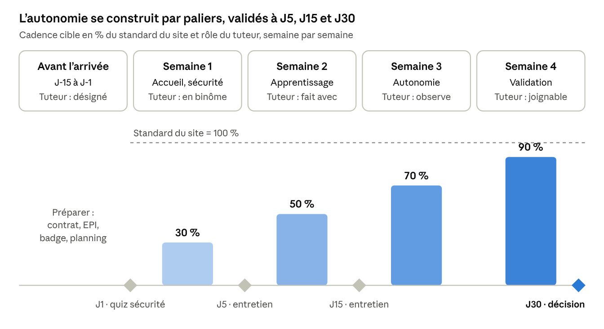

# Programme d'onboarding — Préparateur de commandes et mise en rayon (30 jours)

4 octobre 2026

## Synthèse et enjeux

Ce programme rend un préparateur de commandes et de mise en rayon autonome, sûr et productif en 30 jours. Il fixe pour chaque semaine un objectif, un contenu, un responsable et un critère de validation. Il s'appuie sur le droit belge : la loi du 4 août 1996 relative au bien-être des travailleurs et le Code du bien-être au travail.

Les premières semaines décident de la suite. En entrepôt comme en magasin, les départs précoces et les accidents se concentrent sur les nouveaux arrivants. Un accueil structuré réduit ces deux risques et accélère l'atteinte des cadences.

**Ce que le programme garantit :**

- **Sécurité d'abord.** Aucune tâche à risque n'est confiée avant la formation sécurité, conformément au Code du bien-être au travail.
- **Une montée en charge progressive.** La cadence attendue passe par paliers de 30 % à 90 % du standard, sans pression prématurée.
- **Un tuteur nommé.** Chaque nouvel arrivant a un référent terrain du premier au dernier jour.
- **Des points de contrôle formels.** Trois entretiens à J5, J15 et J30 mesurent la progression et l'intégration.
- **Une décision éclairée.** À J30, le manager dispose d'une grille objective pour valider l'autonomie ou prolonger l'accompagnement.

**Les chiffres qui justifient l'effort :**

- Selon Gallup, seuls 12 % des salariés estiment que leur organisation fait un excellent travail d'intégration.
- Selon Gallup, quand le manager s'implique activement, le nouveau salarié a 3,4 fois plus de chances de juger son intégration exceptionnelle.
- Selon Brandon Hall Group, une intégration solide améliore la rétention des nouveaux salariés de 82 % et leur productivité de plus de 70 %.
- En Belgique, l'employeur doit organiser l'accueil de chaque nouveau travailleur et lui désigner un travailleur expérimenté pour l'accompagner, selon le Code du bien-être au travail.

## Fondements : ce que dit la littérature

Le programme combine six cadres reconnus. Chacun répond à une question précise et se traduit par une règle concrète dans le parcours.

| Cadre | Auteur ou source | Idée clé | Traduction dans ce programme |
| --- | --- | --- | --- |
| Les 4 C de l'intégration | Talya Bauer, SHRM Foundation | Une intégration réussie couvre Conformité, Clarification, Culture et Connexion. | Chaque semaine traite les 4 C. La Connexion repose sur le tuteur et les pauses partagées. |
| Modèle 70-20-10 | Lombardo et Eichinger, Center for Creative Leadership | On apprend à 70 % en faisant, 20 % avec les autres, 10 % en formation formelle. | Peu de salle, beaucoup de terrain en binôme, des débriefs courts et fréquents. |
| Accueil et accompagnement obligatoires | Loi du 4 août 1996 et Code du bien-être au travail, livre Ier, titre 2 | L'employeur organise l'accueil de chaque nouveau travailleur et désigne un travailleur expérimenté pour l'accompagner. Pour un intérimaire, l'entreprise utilisatrice établit une fiche de poste de travail (livre X, titre 2). | Le jour 1 est consacré à la sécurité. Aucune tâche à risque avant sa validation. |
| Manutention manuelle et ergonomie | Code du bien-être au travail, livre VIII, titre 3 ; Prevent et BeSWIC | L'employeur évalue les risques, notamment dorsolombaires, puis informe et forme. Le salarié apprend à analyser sa situation de travail, pas seulement « les bons gestes ». | Atelier manutention en semaine 1, observation du poste en semaine 3. |
| Travail standardisé et 5S | Lean management, Toyota Production System | Une méthode unique, visuelle et documentée réduit les erreurs et accélère l'apprentissage. | Modes opératoires affichés, une seule façon de prélever, ranger et contrôler. |
| Évaluation en 4 niveaux | Donald Kirkpatrick | On mesure la réaction, l'apprentissage, le comportement au poste et le résultat. | Questionnaire à chaud, quiz sécurité, grille d'observation, indicateurs de productivité et de qualité. |

Deux apports complètent ce socle. Michael Watkins (*The First 90 Days*) insiste sur les « victoires rapides » qui donnent confiance : le nouvel arrivant réalise une vraie commande dès le jour 2. Les travaux sur le tutorat montrent qu'un référent identifié réduit l'isolement et les départs pendant les premières semaines. En Belgique, cet accompagnement par un travailleur expérimenté est d'ailleurs obligatoire.

## Le poste en bref

Le préparateur de commandes et de mise en rayon prélève les bons produits, dans les bonnes quantités, au bon moment, et maintient des rayons pleins, propres et conformes. Il travaille en entrepôt, en drive ou en magasin selon l'organisation du site.

**Missions principales :**

1. **Réception et contrôle.** Décharger, compter, contrôler l'état des colis et signaler les anomalies.
2. **Préparation de commandes.** Prélever selon le bon, le scanner, la commande vocale ou le pick-to-light, puis contrôler la quantité et la référence.
3. **Conditionnement et expédition.** Filmer, étiqueter et stabiliser les palettes, puis les déposer en zone d'expédition.
4. **Mise en rayon.** Remplir selon le planogramme, appliquer la rotation FIFO ou FEFO, faire le facing et vérifier les étiquettes prix.
5. **Gestion des stocks.** Signaler les ruptures, participer aux inventaires tournants et retirer les produits périmés ou abîmés.
6. **Rangement et propreté.** Appliquer les 5S, évacuer les déchets et cartons, garder les allées dégagées.

**Compétences attendues à J30 :**

| Domaine | Savoir-faire | Savoir-être |
| --- | --- | --- |
| Sécurité | Port des équipements de protection, gestes et postures, circulation piéton et engins | Vigilance, respect strict des consignes |
| Outils | Terminal de scan, logiciel de gestion d'entrepôt (WMS), transpalette manuel, transpalette électrique après formation adéquate | Curiosité, signalement des bugs |
| Qualité | Contrôle référence et quantité, colisage, rotation des dates | Rigueur, souci du client final |
| Productivité | Maîtrise des circuits de prélèvement, organisation de la palette | Endurance, régularité |
| Équipe | Passation entre équipes, remontée d'information | Entraide, ponctualité |

**Indicateurs suivis :**

| Indicateur | Définition | Comment on le mesure |
| --- | --- | --- |
| Productivité | Lignes ou colis préparés par heure | Extraction WMS, en % du standard du site |
| Taux d'erreur | Commandes avec erreur de référence ou de quantité | Contrôles qualité et retours clients |
| Taux de rupture en rayon | Références vides alors que le stock existe | Relevé visuel ou outil magasin |
| Casse et démarque | Produits endommagés par la manutention | Déclarations de casse |
| Sécurité | Presque-accidents signalés, accidents | Registre sécurité |

Les standards chiffrés varient selon le site, les produits et l'outil de préparation. Le manager les renseigne avant l'arrivée du nouveau salarié.

## Rôles et responsabilités

Quatre acteurs portent l'intégration. Le manager en est responsable de bout en bout, le tuteur la fait vivre au quotidien.

| Acteur | Responsabilités | Temps à prévoir |
| --- | --- | --- |
| Manager de proximité | Prépare l'arrivée, accueille le jour 1, fixe les objectifs, mène les entretiens J5, J15 et J30, décide de la validation | Environ 1 h le jour 1, puis 15 min par jour en semaine 1 et 30 min par entretien |
| Tuteur terrain | Montre, fait faire, corrige, rassure. Remplit la grille d'observation chaque fin de semaine | Binôme complet en semaine 1, dégressif ensuite |
| Ressources humaines | Contrat, déclaration Dimona, évaluation de santé si le poste l'exige, livret d'accueil, badge, paie | Avant l'arrivée et le jour 1 |
| Conseiller en prévention ou QHSE | Accueil sécurité, remise des équipements, formations à la conduite des engins, quiz sécurité | Une demi-journée le jour 1, puis un contrôle en semaine 3 |

**Choisir le bon tuteur :**

- Au moins six mois d'ancienneté et des résultats qualité au-dessus de la moyenne.
- Volontaire, patient et exemplaire sur la sécurité.
- Son objectif de productivité est allégé pendant le tutorat, sinon il n'a pas le temps de former.
- Sa mission est reconnue, par exemple dans l'entretien annuel ou par une prime de tutorat.

## Pré-boarding : de J-15 à J-1

L'intégration commence avant le premier jour. Un nouvel arrivant attendu, équipé et informé arrive rassuré et ne décroche pas entre la signature et la prise de poste.

**J-15 à J-8 : administratif et logistique**

- [ ] Contrat signé et déclaration Dimona effectuée avant le premier jour de travail.
- [ ] Pour un intérimaire : fiche de poste de travail établie avec l'agence. Elle décrit les risques du poste, les équipements de protection et la surveillance de santé requise.
- [ ] Évaluation de santé préalable programmée auprès du service externe de prévention et de protection au travail si le poste l'exige, par exemple un poste de sécurité ou une manutention à risque. Elle a lieu avant l'affectation au poste.
- [ ] Tailles relevées et équipements commandés : chaussures de sécurité, gants anti-coupure, gilet haute visibilité, vêtement grand froid si zone froide.
- [ ] Badge d'accès, casier et identifiants informatiques (WMS, terminal) demandés.
- [ ] Tuteur désigné, informé et planning de binôme calé sur 4 semaines. C'est le travailleur expérimenté que le Code du bien-être au travail impose de désigner.
- [ ] Standards du site renseignés : cadence cible, taux d'erreur toléré, horaires et rotations d'équipe.

**J-7 à J-3 : premier contact**

- [ ] Appel de bienvenue du manager, environ 10 minutes.
- [ ] Envoi du message de bienvenue : adresse, accès, parking ou transports, horaire d'arrivée, tenue, documents à apporter, nom et photo du tuteur.
- [ ] Envoi du livret d'accueil et du planning de la semaine 1.

**J-2 à J-1 : la veille**

- [ ] Équipe prévenue de l'arrivée, prénom et poste annoncés au brief.
- [ ] Équipements, badge, casier et kit d'accueil prêts sur place.
- [ ] Salle de formation et supports sécurité réservés.
- [ ] SMS de rappel la veille : « Nous vous attendons demain à 7 h 45 à l'accueil, demandez [nom du tuteur]. »

## Semaine 1 : accueillir et sécuriser

Objectif de la semaine : travailler en sécurité, connaître le site et réaliser des préparations simples en binôme. Cadence attendue : aucune, puis environ 30 % du standard en fin de semaine.

| Jour | Matin | Après-midi | Validation du jour |
| --- | --- | --- | --- |
| J1 – Bienvenue et sécurité | Accueil par le manager, présentation de l'entreprise, de ses clients et de ses valeurs. Formalités RH, badge, casier. Accueil sécurité : plan de circulation, zones interdites, issues de secours, consignes incendie, premiers secours, droit de s'écarter d'un danger grave et immédiat. | Remise et réglage des équipements de protection. Visite complète du site avec le tuteur : réception, stockage, préparation, expédition, rayons. Présentation à l'équipe et pause partagée. | Quiz sécurité réussi. Attestation de formation sécurité signée. |
| J2 – Gestes et outils | Atelier manutention et ergonomie : échauffement, prise de charge, travail jambes fléchies, rotation du corps sans torsion du dos, aides à la manutention. | Prise en main du terminal de scan et des écrans du WMS. Première commande simple réalisée avec le tuteur, du prélèvement au dépôt. | Première commande complète sans erreur, en binôme. |
| J3 – La préparation | Le tuteur fait, le nouveau observe et commente. Logique d'adressage, ordre de prélèvement, construction d'une palette stable : lourd en bas, fragile en haut. | Le nouveau fait, le tuteur observe et corrige. Contrôle référence et quantité à chaque ligne. | Palette montée, filmée et étiquetée correctement. |
| J4 – La mise en rayon | Lecture d'un planogramme, rotation FIFO et FEFO, facing, contrôle des dates et des étiquettes prix. | Mise en rayon d'un linéaire complet en binôme. Gestion des cartons et déchets, tri. | Rayon conforme au planogramme, aucune date dépassée. |
| J5 – Consolidation | Préparation en binôme, le tuteur intervient le moins possible. | Entretien J5 avec le manager. Questionnaire à chaud sur la semaine. | Entretien J5 réalisé, points de vigilance notés. |

**Règles de la semaine 1 :**

- Pas de conduite d'engin motorisé sans formation adéquate. La Belgique n'impose pas de permis légal, mais la conduite d'un chariot élévateur est réservée aux travailleurs formés. C'est aussi un poste de sécurité, soumis à l'évaluation de santé par le conseiller en prévention-médecin du travail.
- Pas de travail seul, pas de travail en hauteur.
- Pauses respectées et hydratation encouragée : le corps n'est pas encore habitué à l'effort.
- Le manager passe voir le nouveau au moins deux fois par jour.

## Semaines 2 à 4 : apprendre, gagner en autonomie, valider

Le tuteur s'efface progressivement : il fait avec en semaine 2, il observe en semaine 3, il reste joignable en semaine 4.

### Semaine 2 : apprendre en faisant

Objectif : maîtriser les préparations courantes et la mise en rayon standard, avec un tuteur à proximité. Cadence cible : environ 50 % du standard.

- **Préparation.** Commandes multi-références, gestion des emplacements vides et des manquants, procédure d'anomalie.
- **Mise en rayon.** Réassort d'un rayon seul, contrôlé en fin de poste par le tuteur.
- **Outils.** Formation adéquate à la conduite du transpalette électrique si le poste l'exige, avec évaluation de santé préalable s'il s'agit d'un poste de sécurité.
- **Qualité.** Première lecture de ses propres erreurs avec le tuteur, sans jugement : comprendre la cause, pas chercher un coupable.
- **Culture.** Participation au brief d'équipe et au point sécurité du jour.
- **Rituel.** Débrief de 10 minutes avec le tuteur chaque fin de journée : une réussite, une difficulté, un objectif pour demain.

### Semaine 3 : monter en autonomie

Objectif : travailler seul sur les tâches courantes, le tuteur intervenant à la demande. Cadence cible : environ 70 % du standard.

- **Autonomie.** Le nouveau gère seul une tournée de préparation ou un rayon complet, de bout en bout.
- **Cas particuliers.** Produits fragiles, lourds, dangereux ou sous température dirigée. Retours clients et casse.
- **Inventaire.** Participation à un inventaire tournant.
- **Sécurité.** Observation du poste par le conseiller en prévention : postures, port des équipements, circulation. Le nouveau propose une amélioration de son poste, à partir de l'analyse ergonomique de sa situation de travail.
- **Rapport d'étonnement.** Le nouveau note ce qui l'a surpris, ce qui fonctionne et ce qui pourrait être amélioré. Son regard neuf est une ressource pour l'équipe.
- **Rituel.** Entretien J15 avec le manager en début de semaine.

### Semaine 4 : consolider et valider

Objectif : tenir le poste en autonomie complète, en qualité et en sécurité. Cadence cible : environ 90 % du standard.

- **Autonomie complète.** Poste tenu seul sur une rotation d'équipe normale, y compris en période de pointe.
- **Polyvalence.** Découverte d'un poste voisin : réception ou expédition, pour comprendre l'impact de son travail sur la chaîne.
- **Transmission.** Le nouveau explique une tâche à un collègue ou au prochain arrivant : enseigner consolide l'apprentissage.
- **Évaluation.** Grille de compétences complétée par le tuteur, puis entretien J30 avec le manager.
- **Décision.** Validation de l'autonomie, ou plan d'accompagnement de 2 à 4 semaines supplémentaires avec des objectifs précis.

## Feuille de route et paliers de montée en compétence

La cadence attendue monte par paliers de 30 % à 90 % du standard. Le standard complet n'est exigé qu'après la validation de J30.

Ces paliers sont des repères, pas des sanctions. Le taux d'erreur et la sécurité priment toujours sur la vitesse : un nouvel arrivant rapide mais imprécis n'est pas validé. Le manager adapte les paliers à la difficulté du site, par exemple en zone froide ou avec des charges lourdes.

## Grille d'évaluation des compétences

Le tuteur remplit la grille en fin de semaines 1, 2 et 4, sur observation au poste. Le manager s'en sert pour les entretiens et pour la décision de J30.

**Échelle :** 1 = découvre, a besoin d'être guidé · 2 = réalise avec aide ponctuelle · 3 = autonome sur les cas courants · 4 = autonome sur tous les cas, peut transmettre.

| Compétence | Niveau attendu à J30 | S1 | S2 | S4 | Commentaire du tuteur |
| --- | --- | --- | --- | --- | --- |
| Respecte les consignes de sécurité et porte ses équipements | 4 (non négociable) | | | | |
| Applique les gestes et postures de manutention | 3 | | | | |
| Circule en respectant le plan de circulation piétons et engins | 4 (non négociable) | | | | |
| Utilise le terminal de scan et le WMS | 3 | | | | |
| Prélève la bonne référence et la bonne quantité | 3 | | | | |
| Construit une palette stable, filmée et étiquetée | 3 | | | | |
| Met en rayon selon le planogramme | 3 | | | | |
| Applique la rotation FIFO ou FEFO et contrôle les dates | 3 | | | | |
| Signale ruptures, anomalies et casse | 3 | | | | |
| Tient son poste propre et rangé (5S) | 3 | | | | |
| Atteint la cadence cible de la semaine | 3 | | | | |
| Travaille en équipe et communique | 3 | | | | |
| Est ponctuel et assidu | 4 | | | | |

**Règle de décision à J30 :**

- **Validé.** Toutes les compétences sécurité au niveau 4 et toutes les autres au moins au niveau 3.
- **Prolongé.** Une ou deux compétences non sécurité au niveau 2 : plan d'accompagnement ciblé de 2 à 4 semaines.
- **Alerte.** Une compétence sécurité sous le niveau 4, ou trois compétences ou plus au niveau 2 : point immédiat avec les RH, ou avec l'agence pour un intérimaire.

## Entretiens de suivi : J5, J15, J30

Chaque entretien dure 20 à 30 minutes, au calme, hors de la zone de travail. Le manager écoute d'abord, puis donne son retour et fixe deux ou trois objectifs pour la période suivante.

### Entretien J5 : la première impression

But : repérer tôt un décalage entre le poste imaginé et le poste réel.

- Comment s'est passée cette première semaine, physiquement et moralement ?
- Le poste correspond-il à ce qu'on vous avait décrit au recrutement ?
- Vous êtes-vous senti accueilli par l'équipe ? Savez-vous à qui vous adresser ?
- Y a-t-il une consigne de sécurité qui vous semble floue ?
- De quoi avez-vous besoin pour la semaine prochaine ?

### Entretien J15 : le point d'étape

But : mesurer la progression et ajuster l'accompagnement.

- Quelles tâches maîtrisez-vous maintenant ? Lesquelles restent difficiles ?
- Comment se passe le travail avec votre tuteur ?
- Ressentez-vous des douleurs ou une fatigue inhabituelle ? Le cas échéant, orientation vers le conseiller en prévention-médecin du travail.
- Partage de la grille de la semaine 2 et des premiers indicateurs.
- Premiers éléments du rapport d'étonnement.

### Entretien J30 : le bilan et la décision

But : valider l'autonomie et projeter la suite.

- Bilan de la grille de compétences et des indicateurs du mois.
- Restitution du rapport d'étonnement : ce que l'entreprise en retient.
- Notre intégration vous a-t-elle aidé ? Que faudrait-il changer pour le prochain arrivant ?
- Vous voyez-vous dans l'équipe dans six mois ? Quelles envies d'évolution : cariste, chef d'équipe, tuteur ?
- Décision : autonomie validée ou plan d'accompagnement, objectifs à trois mois, date du prochain point.

## Pilotage du programme, kit d'accueil et annexes

Le programme se mesure lui-même. Ses résultats sont revus chaque trimestre pour l'améliorer.

**Indicateurs du programme, sur les quatre niveaux de Kirkpatrick :**

| Niveau | Ce qu'on mesure | Outil | Quand |
| --- | --- | --- | --- |
| 1. Réaction | Satisfaction du nouvel arrivant | Questionnaire à chaud, 5 questions | J5 et J30 |
| 2. Apprentissage | Connaissance des règles de sécurité et des procédures | Quiz sécurité, démonstration au poste | J1 et semaine 3 |
| 3. Comportement | Application au poste | Grille de compétences | Semaines 1, 2 et 4 |
| 4. Résultats | Impact pour le site | Taux de maintien à 3 et 6 mois, délai pour atteindre le standard, taux d'erreur, accidents des moins de 3 mois d'ancienneté | Chaque trimestre |

**Kit d'accueil remis le jour 1 :**

- Livret d'accueil : histoire de l'entreprise, organigramme, contacts utiles, horaires, règlement intérieur.
- Plan du site avec circulation piétons et engins.
- Fiche réflexe sécurité au format poche : numéros d'urgence, secouristes du site, conduite à tenir.
- Modes opératoires illustrés : prélèvement, palettisation, mise en rayon, rotation des dates.
- Lexique du métier : WMS, picking, FIFO, FEFO, facing, planogramme, colisage, linéaire.
- Planning des 4 semaines avec le nom du tuteur.
- Équipements de protection individuelle et tenue.

**Annexe 1. Trame du rapport d'étonnement, remis en semaine 3 :**

1. Ce qui m'a agréablement surpris.
2. Ce qui m'a dérouté ou mis en difficulté.
3. Ce que je faisais autrement ailleurs et qui pourrait servir ici.
4. Une idée pour améliorer la sécurité, la qualité ou le confort au poste.
5. Ce qui aiderait le prochain arrivant.

**Annexe 2. Questionnaire à chaud, note de 1 à 5 :**

1. Je me suis senti attendu et bien accueilli.
2. Je sais ce qu'on attend de moi.
3. Je connais les règles de sécurité de mon poste.
4. Mon tuteur a été disponible et utile.
5. Je recommanderais l'entreprise à un proche.

## Sources

- Gallup, [Why the Onboarding Experience Is Key for Retention](https://www.gallup.com/workplace/247172/problems-onboarding-program.aspx) : 12 % et effet × 3,4 de l'implication du manager.
- Gallup, [Creating an Exceptional Onboarding Journey for Your New Employees](https://www.gallup.com/file/workplace/247076/Gallup_Perspective_on_Creating_an_Exceptional_Onboarding_Journey_for_Your_New_Employees.pdf).
- Brandon Hall Group pour Glassdoor, étude reprise par [StrongDM, Employee Onboarding Statistics](https://www.strongdm.com/blog/employee-onboarding-statistics) : rétention + 82 %, productivité + 70 %.
- Talya Bauer, *Onboarding New Employees: Maximizing Success*, SHRM Foundation, présenté par [Cisive, The 4 C's of Onboarding](https://www.cisive.com/blog/4-cs-of-onboarding).
- SPF Emploi, Travail et Concertation sociale, [Code du bien-être au travail](https://emploi.belgique.be/fr/themes/bien-etre-au-travail/principes-generaux/code-du-bien-etre-au-travail) : livre Ier, titre 2 (accueil et accompagnement des nouveaux travailleurs), article I.2-26 (droit de s'écarter d'un danger grave et immédiat), livre IV (équipements de travail mobiles), livre VIII, titre 3 (manutention manuelle de charges), livre X, titre 2 (travail intérimaire).
- SPF Emploi, [L'accueil et l'accompagnement des nouveaux travailleurs](https://emploi.belgique.be/fr/actualites/laccueil-et-laccompagnement-des-nouveaux-travailleurs).
- SPF Emploi, [Permis de conduire pour chariot de manutention automoteur](https://emploi.belgique.be/fr/themes/bien-etre-au-travail/equipements-de-travail/equipements-de-travail-mobiles/permis-de).
- SPF Emploi, [Manutention manuelle de charges](https://emploi.belgique.be/fr/themes/bien-etre-au-travail/ergonomie-au-travail-et-prevention-des-tms/manutention-manuelle-de).
- SPF Emploi, [Travail intérimaire](https://emploi.belgique.be/fr/themes/bien-etre-au-travail/organisation-de-travail-et-categories-specifiques-du-travailleurs-4), et le site fichepostedetravail.be de Prévention et Intérim.
- Loi du 4 août 1996 relative au bien-être des travailleurs lors de l'exécution de leur travail.
- Michael Watkins, *The First 90 Days*, Harvard Business Review Press.
- Donald et James Kirkpatrick, *Evaluating Training Programs: The Four Levels*, Berrett-Koehler.
- Michael Lombardo et Robert Eichinger, *The Career Architect Development Planner*, modèle 70-20-10.
