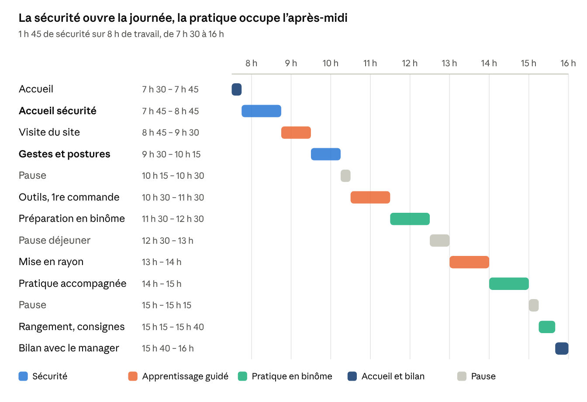

# Onboarding en une journée (8 h) — Préparateur de commandes et mise en rayon

4 octobre 2026

## Synthèse

En une journée de 8 heures de travail, ce parcours rend un nouveau préparateur capable de travailler en sécurité et de réaliser seul des préparations et des mises en rayon simples. Il ne vise pas l'autonomie complète : c'est l'objectif du [programme sur 30 jours](README.md). Il respecte le droit belge du bien-être au travail.

**Quand l'utiliser :**

- Intérimaires et contrats courts.
- Renforts saisonniers et pics d'activité : soldes, fêtes de fin d'année, rentrée.
- Premier jour d'un salarié en CDI, avant de basculer sur le programme de 30 jours.

**Ce que la journée garantit :**

- **Sécurité d'abord.** La première heure est consacrée à l'accueil sécurité, et aucune tâche n'est confiée avant le quiz réussi.
- **Une première réussite avant midi.** Le nouvel arrivant réalise une vraie commande complète avant la pause déjeuner.
- **Un tuteur toute la journée.** Le nouvel arrivant n'est jamais seul.
- **Une décision claire à 16 h.** Le manager sait sur quelles tâches le nouveau peut être affecté le lendemain, et avec quel accompagnement.

**Horaires de référence :** de 7 h 30 à 16 h, soit 8 heures de travail effectif et 30 minutes de pause déjeuner. Le manager décale ces horaires selon le rythme du site, en gardant l'ordre des blocs.

## Ce qui change par rapport au programme sur 30 jours

La journée garde les fondamentaux du programme complet : la sécurité en premier, un tuteur nommé, l'apprentissage par la pratique et une évaluation formelle. Elle comprime le reste.

| Élément | Programme sur 30 jours | Journée de 8 h |
| --- | --- | --- |
| Objectif | Autonomie complète, environ 90 % du standard | Sécurité acquise et tâches simples réalisées seul |
| Accueil sécurité | Une demi-journée le jour 1 | 1 heure, plus 45 minutes de gestes et postures |
| Tutorat | Binôme dégressif sur 4 semaines | Binôme continu toute la journée |
| Cadence attendue | Paliers de 30 % à 90 % du standard | Aucune exigence, mesure indicative l'après-midi |
| Entretiens | J5, J15 et J30 | Un bilan de 20 minutes en fin de journée |
| Grille d'évaluation | 13 compétences, notes de 1 à 4 | 8 points de contrôle, acquis ou non acquis |
| Engins motorisés | Transpalette électrique possible en semaine 2 | Aucun : transpalette manuel uniquement |
| Suivi après le parcours | Plan d'accompagnement si besoin | Point quotidien de 5 minutes de J+1 à J+5 |

Les 4 C de Talya Bauer restent couverts : la Conformité par l'accueil sécurité, la Clarification par les objectifs annoncés à 7 h 30, la Culture par la visite et le brief, la Connexion par le tuteur et les pauses partagées.

## Préparer la journée : de J-3 à J-1

Une journée de 8 heures ne laisse aucune place à l'improvisation. Tout ce qui peut être réglé avant l'arrivée doit l'être.

**J-3 : administratif et matériel**

- [ ] Contrat de travail ou contrat de travail intérimaire signé, déclaration Dimona faite avant le premier jour.
- [ ] Pour un intérimaire, fiche de poste de travail établie avec l'agence : risques du poste, équipements de protection et surveillance de santé requise. Si le poste exige une évaluation de santé préalable, elle a lieu avant la journée.
- [ ] Tailles relevées, équipements de protection prêts : chaussures de sécurité, gants anti-coupure, gilet haute visibilité, vêtement grand froid si zone froide.
- [ ] Badge, casier et identifiants du terminal de scan créés.

**J-2 : organisation**

- [ ] Tuteur désigné et libéré de son objectif de productivité pour la journée. C'est le travailleur expérimenté que le Code du bien-être au travail impose de désigner.
- [ ] Conseiller en prévention, ou son relais sur le site, disponible de 7 h 45 à 8 h 45.
- [ ] Zone de préparation simple choisie pour la pratique : produits légers, références peu nombreuses.
- [ ] Rayon d'entraînement choisi pour la mise en rayon de l'après-midi.
- [ ] Quiz sécurité, attestation de formation et grille de fin de journée imprimés.

**J-1 : confirmation**

- [ ] SMS ou appel au nouvel arrivant : « Nous vous attendons demain à 7 h 30 à l'accueil, en chaussures de sécurité si vous en avez, et demandez [nom du tuteur]. »
- [ ] Équipe prévenue au brief de l'arrivée du nouveau.

## La journée en un coup d'œil

La sécurité occupe la première partie de la matinée, la première commande arrive avant midi et l'après-midi est consacré à la pratique.

Le nouvel arrivant fait d'abord avec le tuteur, puis seul sous son regard. Le bilan de 15 h 40 clôt la journée avec une décision.

## Déroulé heure par heure

La matinée installe la sécurité et les gestes. L'après-midi est consacré à la pratique, avec un tuteur qui s'efface progressivement.

| Horaire | Bloc | Contenu | Responsable | Validation |
| --- | --- | --- | --- | --- |
| 7 h 30 – 7 h 45 | Accueil | Bienvenue, café, badge et casier. Présentation du tuteur. Annonce des objectifs de la journée et de l'heure du bilan. | Manager | Le nouveau connaît son tuteur et le programme. |
| 7 h 45 – 8 h 45 | Accueil sécurité | Plan de circulation piétons et engins, zones interdites, issues de secours, consignes incendie, secouristes du site, droit de s'écarter d'un danger grave et immédiat. Remise et réglage des équipements de protection. | Conseiller en prévention | Quiz sécurité réussi, attestation signée. |
| 8 h 45 – 9 h 30 | Visite du site | Parcours réception, stockage, préparation, expédition et rayons. Présentation à l'équipe. Explication du rôle du poste dans la chaîne, jusqu'au client final. | Tuteur | Le nouveau situe chaque zone sur le plan. |
| 9 h 30 – 10 h 15 | Gestes et postures | Atelier manutention et ergonomie : échauffement, prise de charge près du corps, jambes fléchies, pas de torsion du dos, usage du transpalette manuel et des aides à la manutention. | Tuteur ou conseiller en prévention | Démonstration correcte sur trois charges différentes. |
| 10 h 15 – 10 h 30 | Pause | Pause partagée avec l'équipe. | Tuteur | |
| 10 h 30 – 11 h 30 | Outils et première commande | Prise en main du terminal de scan. Lecture d'une adresse d'emplacement. Le tuteur réalise une commande en commentant, puis le nouveau en réalise une avec lui. | Tuteur | Première commande complète sans erreur, en binôme. |
| 11 h 30 – 12 h 30 | Préparation en binôme | Le nouveau prépare, le tuteur observe et corrige. Contrôle référence et quantité à chaque ligne. Palette stable : lourd en bas, fragile en haut, filmée et étiquetée. | Tuteur | Palette conforme. |
| 12 h 30 – 13 h 00 | Pause déjeuner | Repas, si possible avec le tuteur ou l'équipe. Non compté dans les 8 heures. | | |
| 13 h 00 – 14 h 00 | Mise en rayon | Lecture du planogramme, rotation FIFO et FEFO, facing, contrôle des dates et des étiquettes prix, gestion des cartons. Un linéaire complet en binôme. | Tuteur | Rayon conforme, aucune date dépassée. |
| 14 h 00 – 15 h 00 | Pratique accompagnée | Le nouveau travaille seul sur des tâches simples, en préparation ou en rayon. Le tuteur reste à proximité et intervient à la demande. Relevé indicatif de la cadence. | Tuteur | Cadence relevée, erreurs notées. |
| 15 h 00 – 15 h 15 | Pause | Pause et hydratation. | Tuteur | |
| 15 h 15 – 15 h 40 | Rangement et passage de consignes | Poste rangé selon les 5S, déchets et cartons évacués. Le nouveau transmet ce qu'il a fait à l'équipe suivante ou au tuteur. | Tuteur | Poste propre, consignes transmises. |
| 15 h 40 – 16 h 00 | Bilan | Grille de fin de journée, questions de bilan, décision d'affectation pour le lendemain. | Manager | Décision prise et annoncée. |

## Règles de sécurité de la journée

Ces règles ne se négocient pas, même en période de pointe. Elles découlent de la loi du 4 août 1996 sur le bien-être au travail et du Code du bien-être au travail.

- **Aucune tâche avant l'accueil sécurité.** Le nouveau ne touche à aucune marchandise avant le quiz réussi et l'attestation signée.
- **Aucun engin motorisé.** La conduite d'un transpalette électrique ou d'un chariot élévateur est réservée aux travailleurs qui ont reçu une formation adéquate. Le chariot élévateur est aussi un poste de sécurité soumis à l'évaluation de santé. Rien de cela ne s'acquiert en une journée.
- **Jamais seul.** Le tuteur reste à portée de voix toute la journée, y compris pendant la pratique accompagnée.
- **Pas de travail en hauteur.** Aucun accès aux niveaux supérieurs des racks, ni escabeau sans formation.
- **Charges limitées.** Le tuteur oriente le nouveau vers des colis légers et des aides à la manutention. La réglementation belge ne fixe pas un poids maximal unique : l'employeur évalue les risques de la manutention, notamment pour le dos, et adapte les charges en conséquence.
- **Pauses respectées.** Le corps n'est pas habitué à l'effort : les deux pauses de 15 minutes et la pause déjeuner sont prises en entier. La loi du 16 mars 1971 sur le travail impose au moins une pause dès que le travail dépasse 6 heures, de 15 minutes à défaut d'autre règle sectorielle.
- **Droit de dire stop.** Le nouveau sait qu'il peut arrêter une tâche qui lui semble dangereuse et prévenir son tuteur, sans reproche. Le Code du bien-être au travail protège le travailleur qui s'écarte d'un danger grave et immédiat.

## Bilan de fin de journée

Le bilan dure 20 minutes, au calme. Le tuteur remplit la grille juste avant, le manager mène l'échange et décide.

**Grille de fin de journée :**

| Point de contrôle | Acquis | Non acquis | Commentaire du tuteur |
| --- | --- | --- | --- |
| Connaît les consignes de sécurité et le plan de circulation | | | |
| Porte ses équipements de protection en permanence | | | |
| Applique les gestes et postures de manutention | | | |
| Utilise le terminal de scan sans aide | | | |
| Prélève la bonne référence et la bonne quantité | | | |
| Monte une palette stable, filmée et étiquetée | | | |
| Met en rayon selon le planogramme et la rotation des dates | | | |
| Range son poste et transmet ses consignes | | | |

**Questions de bilan :**

1. Comment vous sentez-vous après cette journée, physiquement et moralement ?
2. Qu'est-ce qui a été le plus facile ? Le plus difficile ?
3. Y a-t-il une consigne de sécurité qui reste floue pour vous ?
4. Le poste correspond-il à ce qu'on vous avait annoncé ?
5. De quoi avez-vous besoin pour demain ?

**Règle de décision :**

- **Affecté seul aux tâches simples.** Les trois points sécurité sont acquis et au moins quatre des cinq autres aussi. Le tuteur reste joignable.
- **Binôme maintenu.** Les trois points sécurité sont acquis, mais deux points métier ou plus restent à travailler. Le nouveau travaille encore en binôme le lendemain matin.
- **Pas d'affectation.** Un point sécurité n'est pas acquis. L'accueil sécurité est repris le lendemain avant toute tâche, et le manager fait le point avec les RH ou l'agence d'intérim.

## Après la journée : suivi léger de J+1 à J+5

Une journée lance l'intégration, elle ne la termine pas. Un suivi court la première semaine évite les erreurs qui s'installent et les départs silencieux.

- **Chaque matin, 5 minutes avec le tuteur.** Rappel de la consigne sécurité du jour et de l'objectif de la journée.
- **J+1 à J+2 : tâches de la veille.** Le nouveau reste sur les zones et produits déjà vus, la cadence n'est toujours pas exigée.
- **J+3 à J+5 : élargissement.** Nouvelles références, produits plus lourds ou fragiles, première mesure de cadence partagée avec le nouveau.
- **J+5 : point de 15 minutes avec le manager.** Reprise de la grille de fin de journée et décision : poursuite de la mission, bascule sur le programme de 30 jours pour un contrat long, ou fin de l'accompagnement.
- **Pour un intérimaire : retour à l'agence.** Le manager partage un bilan court à J+5 pour faciliter les missions suivantes. Les trois premiers jours d'un contrat intérimaire valent en principe période d'essai : le bilan de la journée éclaire donc la suite de la mission.

## Sources

- [Programme d'onboarding sur 30 jours](README.md), préparateur de commandes et mise en rayon, document source de cette version.
- Talya Bauer, *Onboarding New Employees: Maximizing Success*, SHRM Foundation, présenté par [Cisive, The 4 C's of Onboarding](https://www.cisive.com/blog/4-cs-of-onboarding).
- Gallup, [Why the Onboarding Experience Is Key for Retention](https://www.gallup.com/workplace/247172/problems-onboarding-program.aspx).
- SPF Emploi, Travail et Concertation sociale, [Code du bien-être au travail](https://emploi.belgique.be/fr/themes/bien-etre-au-travail/principes-generaux/code-du-bien-etre-au-travail) : livre Ier, titre 2 (accueil et accompagnement des nouveaux travailleurs), article I.2-26 (droit de s'écarter d'un danger grave et immédiat), livre IV (équipements de travail mobiles), livre VIII, titre 3 (manutention manuelle de charges), livre X, titre 2 (travail intérimaire).
- SPF Emploi, [L'accueil et l'accompagnement des nouveaux travailleurs](https://emploi.belgique.be/fr/actualites/laccueil-et-laccompagnement-des-nouveaux-travailleurs).
- SPF Emploi, [Permis de conduire pour chariot de manutention automoteur](https://emploi.belgique.be/fr/themes/bien-etre-au-travail/equipements-de-travail/equipements-de-travail-mobiles/permis-de).
- SPF Emploi, [Manutention manuelle de charges](https://emploi.belgique.be/fr/themes/bien-etre-au-travail/ergonomie-au-travail-et-prevention-des-tms/manutention-manuelle-de).
- SPF Emploi, [Travail intérimaire](https://emploi.belgique.be/fr/themes/bien-etre-au-travail/organisation-de-travail-et-categories-specifiques-du-travailleurs-4), et le site fichepostedetravail.be de Prévention et Intérim.
- SPF Emploi, [La période d'essai](https://emploi.belgique.be/fr/themes/contrats-de-travail/execution-du-contrat-de-travail/la-periode-dessai).
- Loi du 16 mars 1971 sur le travail, article 38quater (pauses), résumée par [Actualités droit belge](https://www.actualitesdroitbelge.be/droit-du-travail/droit-du-travail-abreges-juridiques/les-pauses-ou-intervalles-de-repos-lors-des-prestations-de-travail/les-pauses-ou-intervalles-de-repos-lors-des-prestations-de-travail).
- Loi du 4 août 1996 relative au bien-être des travailleurs lors de l'exécution de leur travail.
