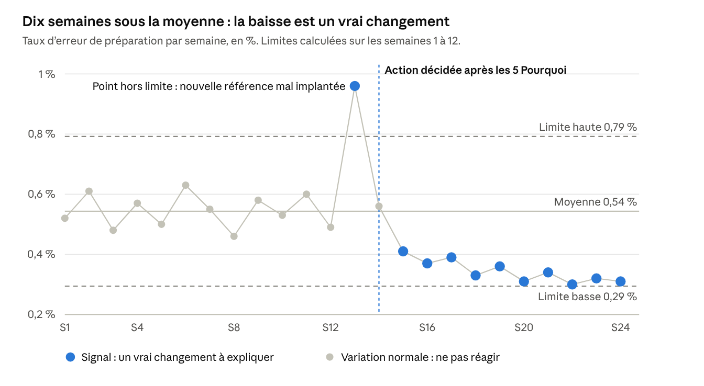

# Suivre l'évolution de son équipe — synthèse et outils pour un suivi rationnel

6 octobre 2026

## Synthèse

Un suivi rationnel compare chaque résultat à sa propre histoire, sépare les vrais changements des variations normales et croise les chiffres avec ce qui se voit et s'entend sur le terrain. La littérature en management, en qualité et en psychologie du travail converge vers cinq principes.

1. **Suivre quatre domaines, pas un seul.** Les résultats, les compétences, l'engagement et la maturité de l'équipe. Un manager qui ne suit que la productivité voit les problèmes trop tard.
2. **Définir chaque indicateur avec précision.** Une formule, une source, une fréquence et un responsable. Sans définition écrite, deux personnes calculent deux chiffres différents.
3. **Mélanger indicateurs avancés et indicateurs retardés.** Les premiers annoncent les problèmes, les seconds les constatent. Les presque-accidents signalés annoncent les accidents.
4. **Distinguer le signal du bruit.** Walter Shewhart et Donald Wheeler montrent que tout chiffre varie naturellement. La carte de contrôle indique quand une variation mérite une action, et quand elle n'en mérite pas.
5. **Trianguler.** Un chiffre dit ce qui se passe, l'observation et l'entretien disent pourquoi. Andy Grove fait de l'entretien individuel régulier le premier outil de suivi du manager.

**Ce que le manager y gagne :** il réagit aux vrais problèmes sans s'agiter sur de fausses alertes, il voit progresser chaque personne et il peut démontrer l'effet de ses actions avec des faits.

## Les quatre domaines à suivre

Chaque domaine répond à une question différente et se mesure à un rythme différent. Ensemble, ils donnent une image complète de l'évolution de l'équipe.

| Domaine | Question posée | Exemples d'indicateurs | Rythme de suivi |
| --- | --- | --- | --- |
| Résultats | L'équipe tient-elle ses engagements ? | Sécurité, taux d'erreur, productivité en % du standard, respect des délais | Jour et semaine |
| Compétences | L'équipe sait-elle faire davantage qu'avant ? | Taux de polyvalence, niveaux de la matrice ILUO, délai pour atteindre l'autonomie | Mois |
| Engagement et stabilité | Les personnes veulent-elles rester et s'investir ? | Absentéisme, départs dans les 6 premiers mois, suggestions, enquête d'engagement | Mois et trimestre |
| Maturité de l'équipe | L'équipe fonctionne-t-elle mieux ensemble ? | Sécurité psychologique, entraide, autonomie dans la résolution de problèmes | Trimestre et semestre |

Les deux premiers domaines se mesurent surtout avec des données. Les deux derniers demandent aussi des questionnaires et de l'observation. C'est pourtant là que se lisent le plus tôt les départs et les baisses de performance à venir.

## Construire des indicateurs précis

Un indicateur n'est précis que s'il est défini par écrit. La fiche indicateur, utilisée en qualité et en contrôle de gestion, fixe une seule façon de le calculer et de le lire.

**Exemple de fiche indicateur :**

| Rubrique | Contenu |
| --- | --- |
| Nom | Taux d'erreur de préparation |
| Question à laquelle il répond | La qualité de préparation de l'équipe s'améliore-t-elle ? |
| Formule | Lignes en erreur divisées par lignes préparées, sur la semaine |
| Ce qui compte comme erreur | Mauvaise référence, mauvaise quantité, produit abîmé à la préparation |
| Source des données | Contrôles qualité et retours clients enregistrés dans le WMS |
| Fréquence | Calcul chaque lundi pour la semaine précédente |
| Niveau de détail | Équipe et zone. Individuel uniquement pour l'accompagnement |
| Cible | Fixée par le site, par exemple 0,4 % |
| Responsable | Team leader de la zone |
| Mode d'affichage | Carte de contrôle sur le tableau d'équipe |

**Indicateurs avancés et indicateurs retardés.** Les indicateurs retardés mesurent un résultat déjà acquis. Les indicateurs avancés mesurent ce qui le prépare et permettent d'agir avant qu'il ne soit trop tard. Kaplan et Norton recommandent de suivre les deux dans le Balanced Scorecard.

| Domaine | Indicateur avancé : il annonce | Indicateur retardé : il constate |
| --- | --- | --- |
| Sécurité | Presque-accidents signalés, observations de sécurité réalisées | Accidents avec arrêt |
| Qualité | Respect du scan produit, anomalies d'emplacement signalées | Erreurs chez le client |
| Compétences | Heures de formation au poste, tuteurs disponibles | Taux de polyvalence |
| Engagement | Résultat de l'enquête d'engagement, suggestions déposées | Départs, absentéisme |

La logique est celle de la pyramide de Heinrich en sécurité : les incidents mineurs et les presque-accidents sont bien plus nombreux que les accidents graves. Les suivre permet d'agir sur les causes avant qu'un accident ne survienne.

## Lire une évolution sans se tromper

Tout indicateur varie d'une semaine à l'autre, même quand rien ne change. La carte de contrôle, inventée par Walter Shewhart et popularisée par Donald Wheeler, calcule la plage de variation normale d'un indicateur. Elle dit au manager quand agir, et surtout quand ne pas agir.

**Comment la lire :**

- **Les semaines 1 à 12 varient entre 0,46 % et 0,63 %, à l'intérieur des limites.** C'est du bruit. Réagir à la semaine 6, la plus haute, aurait été une erreur : il n'y avait rien de particulier à corriger.
- **La semaine 13 dépasse la limite haute.** C'est un signal : une cause particulière existe. L'analyse trouve une nouvelle référence mal implantée, et une action est décidée en semaine 14.
- **À partir de la semaine 15, dix points de suite sont sous la moyenne.** C'est aussi un signal : le niveau a réellement baissé. L'action a fonctionné, et on peut recalculer de nouvelles limites.

**Comment la construire :**

1. Rassembler au moins 12 à 20 valeurs successives de l'indicateur, par exemple hebdomadaires.
2. Calculer la moyenne de ces valeurs.
3. Calculer l'écart moyen entre deux valeurs successives, appelé étendue mobile.
4. Placer les limites à la moyenne plus ou moins 2,66 fois l'étendue mobile moyenne.

**Les trois règles de détection d'un signal**, d'après Wheeler :

| Règle | Ce qu'on observe | Ce que cela veut dire |
| --- | --- | --- |
| 1 | Un point au-dessus de la limite haute ou sous la limite basse | Un événement ponctuel s'est produit : chercher sa cause tout de suite |
| 2 | Huit points de suite du même côté de la moyenne | Le niveau a changé de façon durable, en bien ou en mal |
| 3 | Trois points sur quatre proches d'une même limite | Une dérive est en train de s'installer |

La carte se tient avec un simple tableur. Elle s'applique à tous les indicateurs suivis dans le temps : erreurs, productivité, absentéisme, presque-accidents.

## La boîte à outils par domaine

Les outils ci-dessous sont les plus cités dans la littérature en management des opérations, en qualité et en ressources humaines. Pour chacun : ce qu'il mesure, son origine, et comment l'utiliser en entrepôt.

### Résultats

| Outil | Origine | Ce qu'il permet de suivre | Usage en entrepôt |
| --- | --- | --- | --- |
| Carte de contrôle | Walter Shewhart, 1931, reprise par Donald Wheeler | Savoir si une variation est un vrai changement ou un simple bruit | Taux d'erreur et productivité hebdomadaires de l'équipe |
| Graphique de tendance | Qualité totale | L'évolution d'un indicateur dans le temps, point par point | Tout indicateur affiché sur le tableau d'équipe |
| Tableau SQDCP | Lean, Toyota | Sécurité, qualité, délai, coût et personnel au quotidien | Briefing de démarrage |
| Balanced Scorecard | Kaplan et Norton, 1992 | Un équilibre entre résultats, clients, processus et apprentissage | Revue mensuelle de l'équipe |

### Compétences

| Outil | Origine | Ce qu'il permet de suivre | Usage en entrepôt |
| --- | --- | --- | --- |
| Matrice de polyvalence ILUO | Toyota | Le niveau de chaque personne sur chaque poste, et sa progression | Revue mensuelle, taux de polyvalence de l'équipe |
| Courbe d'apprentissage | Theodore Wright, 1936 | La vitesse normale de progression : le temps par tâche baisse d'un pourcentage stable à chaque doublement de l'expérience | Comparer la montée en cadence d'un nouvel arrivant à la courbe attendue |
| Modèle de Kirkpatrick | Donald Kirkpatrick | L'effet réel d'une formation, jusqu'au résultat au poste | Mesurer si une formation a changé les résultats trois mois après |
| Plan de développement individuel | Gestion des ressources humaines | Les actions de progrès de chaque personne et leur avancement | Revu à chaque entretien |

### Engagement et stabilité

| Outil | Origine | Ce qu'il permet de suivre | Usage en entrepôt |
| --- | --- | --- | --- |
| Questionnaire Q12 | Gallup | L'engagement, en douze questions sur les conditions de travail et la relation au manager | Une fois par an, avec une version courte chaque trimestre |
| eNPS | Dérivé du Net Promoter Score de Frederick Reichheld, 2003 | La recommandation de l'entreprise comme employeur, sur une échelle de 0 à 10 | Une question chaque trimestre, anonyme |
| Analyse par cohorte | Démographie, appliquée aux ressources humaines | Le maintien des personnes recrutées à une même période, à 3, 6 et 12 mois | Mesurer l'effet du programme d'intégration |
| Entretien de maintien | Pratique RH anglo-saxonne, dite « stay interview » | Ce qui retient les personnes et ce qui pourrait les faire partir | Une fois par an avec chaque personne clé |

### Maturité de l'équipe

| Outil | Origine | Ce qu'il permet de suivre | Usage en entrepôt |
| --- | --- | --- | --- |
| Stades de développement d'une équipe | Bruce Tuckman, 1965 | Formation, tension, normalisation, performance : où en est l'équipe | Lire les tensions après une réorganisation ou plusieurs arrivées |
| Sécurité psychologique | Amy Edmondson, 1999 | La liberté de signaler une erreur ou une idée sans crainte, mesurée par un court questionnaire | Une fois par semestre |
| Cinq dysfonctionnements d'une équipe | Patrick Lencioni, 2002 | Confiance, gestion des désaccords, engagement, responsabilité, attention aux résultats | Grille de lecture pour un atelier d'équipe |

### Observation et dialogue, pour tous les domaines

| Outil | Origine | Ce qu'il permet de suivre | Usage en entrepôt |
| --- | --- | --- | --- |
| Entretien individuel régulier | Andy Grove, *High Output Management*, 1983 | Ce que les chiffres ne disent pas : difficultés, motivation, idées | 15 à 30 minutes, au moins une fois par mois avec chacun |
| Gemba walk | Taiichi Ohno, Lean | Le respect des standards et la réalité du terrain | Chaque jour |
| Grilles à ancrages comportementaux | Smith et Kendall, 1963 | Des comportements observés plutôt que des impressions | Entretiens semestriels |
| Feedback à 360 degrés | Littérature en développement du leadership | La perception du leadership par l'équipe et les pairs | Une fois par an pour les team leaders |

## Suivre une personne dans le temps

Le suivi individuel compare la personne à elle-même, pas aux autres. La question n'est pas « est-elle meilleure que son collègue ? » mais « progresse-t-elle au rythme attendu, et de quoi a-t-elle besoin ? ».

**Le dossier de suivi individuel** tient sur une page par personne et se met à jour à chaque entretien.

| Rubrique | Contenu | Mise à jour |
| --- | --- | --- |
| Compétences | Niveau ILUO sur chaque poste, avec la date de chaque progression | Mois |
| Résultats | Tendance sur trois mois : cadence en % du standard, taux d'erreur | Mois |
| Objectifs | Deux ou trois objectifs SMART et leur avancement | Entretien |
| Journal d'observations | Faits datés, positifs comme négatifs, notés au fil de l'eau | Semaine |
| Entretiens | Date, points abordés, engagements pris de part et d'autre | Entretien |
| Plan de développement | Formations, tutorat, missions, souhaits d'évolution | Semestre |

**Le journal d'observations.** John Flanagan a décrit en 1954 la méthode des incidents critiques : noter, au moment où ils se produisent, des faits précis et datés. Cette pratique corrige l'effet de récence, qui fait juger une année entière sur les dernières semaines. Une ligne suffit : « 12/09, a signalé spontanément une palette instable en zone d'expédition. »

**La courbe d'apprentissage pour les nouveaux arrivants.** Theodore Wright a montré que la performance progresse vite au début, puis de plus en plus lentement. Les paliers du programme d'intégration servent de courbe de référence : 30 %, 50 %, 70 %, puis 90 % du standard sur les quatre premières semaines. Un nouvel arrivant nettement sous la courbe a besoin d'aide tout de suite. Un nouvel arrivant au-dessus peut se voir confier davantage plus tôt.

**L'entretien individuel régulier.** Andy Grove le décrit comme un moment qui appartient au collaborateur : c'est lui qui apporte ses sujets. Une trame simple :

1. Comment ça va, sur le poste et en dehors du travail si la personne le souhaite ?
2. Qu'est-ce qui a bien marché depuis la dernière fois ?
3. Qu'est-ce qui te freine ou te gêne ?
4. Où en sont tes objectifs ?
5. De quoi as-tu besoin de ma part ?

## Suivre l'équipe dans le temps

Le tableau de bord mensuel réunit sur une page les indicateurs des quatre domaines, avec leurs trois derniers mois. La colonne « Signal » ne se remplit que si la carte de contrôle détecte un vrai changement : c'est elle qui déclenche une action, pas une simple hausse ou baisse.

**Modèle de tableau de bord, avec des valeurs d'exemple :**

| Domaine | Indicateur | Il y a 2 mois | Le mois dernier | Ce mois-ci | Signal | Action |
| --- | --- | --- | --- | --- | --- | --- |
| Résultats | Accidents avec arrêt | 0 | 0 | 0 | Non | Aucune |
| Résultats | Presque-accidents signalés | 4 | 6 | 9 | Hausse durable | Bonne nouvelle : la culture de signalement progresse |
| Résultats | Taux d'erreur de préparation | 0,55 % | 0,52 % | 0,33 % | Baisse durable | Effet de l'action sur l'allée 12 confirmé |
| Résultats | Productivité en % du standard | 98 % | 101 % | 99 % | Non | Aucune : variation normale |
| Compétences | Taux de polyvalence | 45 % | 48 % | 52 % | Non | Continuer le plan de formation |
| Compétences | Nouveaux arrivants sur la courbe attendue | 2 sur 2 | 1 sur 2 | 2 sur 3 | À surveiller | Point avec le tuteur du nouvel arrivant en retard |
| Engagement | Absentéisme | 4,8 % | 5,1 % | 6,9 % | Oui | Point au-dessus de la limite haute : entretiens individuels pour comprendre, sans jugement |
| Engagement | Départs dans les 6 premiers mois | 0 | 1 | 0 | Non | Aucune |
| Engagement | Suggestions déposées | 5 | 7 | 4 | Non | Aucune |
| Maturité | Problèmes résolus par l'équipe sans escalade | 40 % | 50 % | 55 % | Non | Continuer à déléguer la résolution |

**Lire la maturité de l'équipe.** Bruce Tuckman décrit quatre stades : formation, tension, normalisation et performance. Une équipe qui accueille plusieurs nouveaux arrivants ou qui change de team leader repasse souvent par la phase de tension. Une hausse de l'absentéisme ou des désaccords à ce moment-là est attendue : elle appelle plus de clarté sur les rôles et plus de présence du manager, pas des sanctions.

Les valeurs du tableau sont illustratives.

## Mettre en place le suivi en six étapes

Un bon système de suivi se construit progressivement. Mieux vaut cinq indicateurs fiables et lus chaque semaine que vingt indicateurs que personne ne regarde.

1. **Choisir les questions avant les indicateurs.** Que veut-on savoir sur l'équipe ? Une ou deux questions par domaine suffisent au départ.
2. **Rédiger une fiche par indicateur.** Formule, source, fréquence, responsable. Faire valider les définitions par les team leaders.
3. **Reconstituer l'historique.** Rassembler les 12 à 20 dernières semaines dans le WMS pour calculer la moyenne et les limites de chaque carte de contrôle.
4. **Installer les rituels de lecture.** Lecture hebdomadaire des cartes de contrôle au point d'équipe, tableau de bord mensuel, entretiens individuels mensuels, enquête d'engagement trimestrielle.
5. **Agir uniquement sur les signaux.** Un signal déclenche une analyse avec les 5 Pourquoi ou un diagramme d'Ishikawa. Une variation normale ne déclenche rien, sauf si l'on veut améliorer le niveau moyen lui-même.
6. **Revoir le système chaque trimestre.** Supprimer les indicateurs qui ne servent à aucune décision, recalculer les limites après une amélioration durable.

**Qui fait quoi :**

| Rôle | Responsabilité dans le suivi |
| --- | --- |
| Team leader | Met à jour les indicateurs de son équipe, tient les dossiers individuels, mène les entretiens |
| Responsable d'exploitation | Lit les tableaux de bord de toutes les équipes, arbitre les moyens, suit les team leaders |
| Ressources humaines | Fournit l'absentéisme, les départs et l'enquête d'engagement, garantit le respect du RGPD |
| Équipe | Voit ses propres résultats sur le tableau, propose des actions, répond aux enquêtes |

## Pièges à éviter et points d'attention en Belgique

**Les erreurs de raisonnement les plus fréquentes :**

- **Réagir à chaque variation.** Deming appelle cela « trafiquer le processus » : corriger un système stable à chaque petite hausse augmente la variation au lieu de la réduire.
- **Oublier la régression vers la moyenne.** Après une semaine exceptionnellement mauvaise, la suivante est presque toujours meilleure, avec ou sans action. Daniel Kahneman montre que cela fait croire à tort à l'efficacité des réprimandes et à l'inefficacité des félicitations.
- **Comparer des chiffres qui ne se comparent pas.** Une zone de produits lourds et une zone de petits colis n'ont pas le même standard. On compare une équipe à elle-même ou à son standard, pas à une autre.
- **Transformer l'indicateur en objectif à tout prix.** Selon la loi de Goodhart, un indicateur qui devient une cible cesse d'être une bonne mesure. Exemple : un objectif de « zéro presque-accident » pousse à ne plus les signaler.
- **Trop d'indicateurs.** Au-delà d'une dizaine sur le tableau de bord, aucun n'est vraiment lu.
- **Juger sur les chiffres seuls.** Un chiffre sans entretien ni observation ne dit jamais pourquoi.

**Points d'attention en Belgique :**

- **Données personnelles.** Les données individuelles du WMS, les notes d'entretien et les résultats d'enquête relèvent du RGPD. Il faut informer les personnes de ce qui est suivi et pourquoi, limiter l'accès, fixer une durée de conservation et anonymiser les enquêtes.
- **État de santé et absences.** L'état de santé fait partie des critères protégés par la loi anti-discrimination du 10 mai 2007. L'absentéisme se suit au niveau de l'équipe pour comprendre les conditions de travail, pas pour pénaliser une personne malade. Les indices qui pénalisent la fréquence des absences individuelles sont à éviter.
- **Concertation sociale.** Un nouveau dispositif de suivi doit être présenté au conseil d'entreprise ou, à défaut, à la délégation syndicale. Le comité pour la prévention et la protection au travail est concerné par les indicateurs de sécurité et de charge de travail.
- **Validation juridique.** Faire relire le dispositif par le service juridique ou le secrétariat social avant son lancement.

## Sources

Références bibliographiques, citées de mémoire et non consultées en ligne pour ce document. Les chiffres des exemples sont illustratifs.

**Lire les données et la variation**

- Walter Shewhart, *Economic Control of Quality of Manufactured Product*, Van Nostrand, 1931.
- Donald Wheeler, *Understanding Variation: The Key to Managing Chaos*, SPC Press, 1993.
- W. Edwards Deming, *Out of the Crisis*, MIT Press, 1986.
- Daniel Kahneman, *Thinking, Fast and Slow*, Farrar, Straus and Giroux, 2011 : régression vers la moyenne.
- Charles Goodhart, 1975 : loi de Goodhart.

**Piloter la performance**

- Robert Kaplan et David Norton, « The Balanced Scorecard: Measures That Drive Performance », *Harvard Business Review*, 1992.
- Herbert Heinrich, *Industrial Accident Prevention*, McGraw-Hill, 1931.
- Jeffrey Liker, *The Toyota Way*, McGraw-Hill, 2004.
- Theodore Wright, « Factors Affecting the Cost of Airplanes », *Journal of the Aeronautical Sciences*, 1936 : courbe d'apprentissage.

**Suivre les personnes et l'équipe**

- Andy Grove, *High Output Management*, Random House, 1983 : entretien individuel régulier.
- John Flanagan, « The Critical Incident Technique », *Psychological Bulletin*, 1954.
- Patricia Smith et Lorne Kendall, *Journal of Applied Psychology*, 1963 : grilles à ancrages comportementaux.
- Donald et James Kirkpatrick, *Evaluating Training Programs: The Four Levels*, Berrett-Koehler.
- Gallup, questionnaire Q12 sur l'engagement des salariés.
- Frederick Reichheld, « The One Number You Need to Grow », *Harvard Business Review*, 2003 : origine du Net Promoter Score.
- Bruce Tuckman, « Developmental Sequence in Small Groups », *Psychological Bulletin*, 1965.
- Amy Edmondson, « Psychological Safety and Learning Behavior in Work Teams », *Administrative Science Quarterly*, 1999.
- Patrick Lencioni, *The Five Dysfunctions of a Team*, Jossey-Bass, 2002.

**Cadre belge**

- Règlement général sur la protection des données (RGPD).
- Loi du 10 mai 2007 tendant à lutter contre certaines formes de discrimination.
